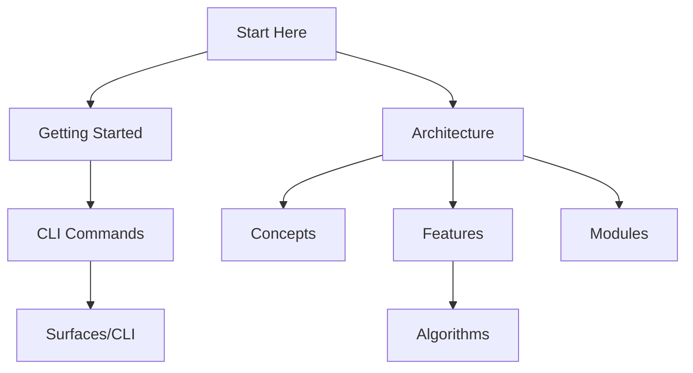

# Iridium Developer Documentation

Developer documentation for **Iridium** - the CyanPrint CLI and Rust libraries for template orchestration, composition, and stateful prompting.

## About

Iridium is a template execution system that enables:

- **Executable templates** - Run templates to generate project scaffolding
- **Template groups** - Compose multiple templates with shared state
- **Stateful prompting** - Track answers across template runs
- **3-way merging** - Update templates while preserving user changes

## Quick Start

1. **New to Iridium?** Start with [Getting Started](./01-getting-started.md)
2. **Understand the system** - Read [Architecture](./02-architecture.md)
3. **Explore concepts** - See [Concepts](./concepts/) for domain terminology
4. **Learn features** - See [Features](./features/) for capabilities
5. **Study modules** - See [Modules](./modules/) for code organization

## Documentation Map



| Section                                    | Description                     | For                    |
| ------------------------------------------ | ------------------------------- | ---------------------- |
| [Getting Started](./01-getting-started.md) | Installation, setup, quickstart | Everyone               |
| [Architecture](./02-architecture.md)       | System overview and design      | Everyone               |
| [Concepts](./concepts/)                    | Domain terminology              | Understanding Iridium  |
| [Features](./features/)                    | Complex capabilities            | Feature implementation |
| [Modules](./modules/)                      | Code organization               | Contributors           |
| [Surfaces](./surfaces/)                    | CLI commands                    | Users & contributors   |
| [Algorithms](./algorithms/)                | Implementation details          | Deep understanding     |

## Key Concepts

| Concept            | Description                  | Link                                                      |
| ------------------ | ---------------------------- | --------------------------------------------------------- |
| Template           | Executable or group template | [Template](./concepts/01-template.md)                     |
| Template Group     | Multi-template composition   | [Template Group](./concepts/02-template-group.md)         |
| Answer Tracking    | Track answers by question ID | [Answer Tracking](./concepts/03-answer-tracking.md)       |
| Stateful Prompting | State during Q&A flow        | [Stateful Prompting](./concepts/05-stateful-prompting.md) |

## Crate Structure

| Crate              | Purpose          | Documentation                                      |
| ------------------ | ---------------- | -------------------------------------------------- |
| `cyanprint/`       | Main CLI binary  | [cyanprint](./modules/01-cyanprint.md)             |
| `cyancoordinator/` | Core engine      | [cyancoordinator](./modules/02-cyancoordinator.md) |
| `cyanprompt/`      | Prompting engine | [cyanprompt](./modules/03-cyanprompt.md)           |
| `cyanregistry/`    | Registry client  | [cyanregistry](./modules/04-cyanregistry.md)       |

## Documentation Structure

```
docs/developer/
├── 00-README.md              # This file - entry point
├── 01-getting-started.md     # Setup and quickstart
├── 02-architecture.md        # System overview
├── concepts/                 # Domain concepts
│   ├── 00-README.md
│   └── XX-*.md
├── features/                 # Complex features
│   ├── 00-README.md
│   └── XX-*.md
├── modules/                  # Code modules
│   ├── 00-README.md
│   └── XX-*.md
├── surfaces/                 # External interfaces
│   ├── 00-README.md
│   └── cli/
│       ├── 00-README.md
│       └── XX-*.md
└── algorithms/               # Implementation details
    ├── 00-README.md
    └── XX-*.md
```
