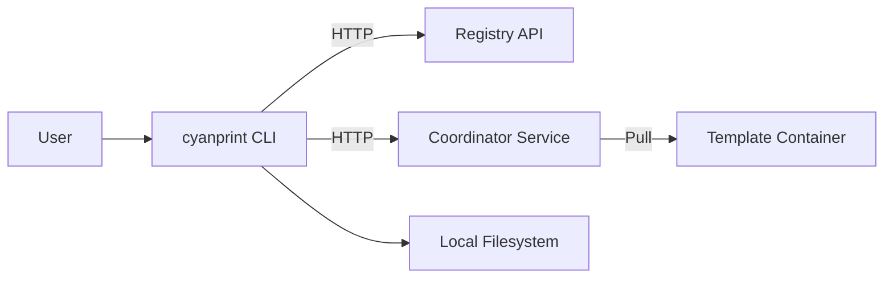
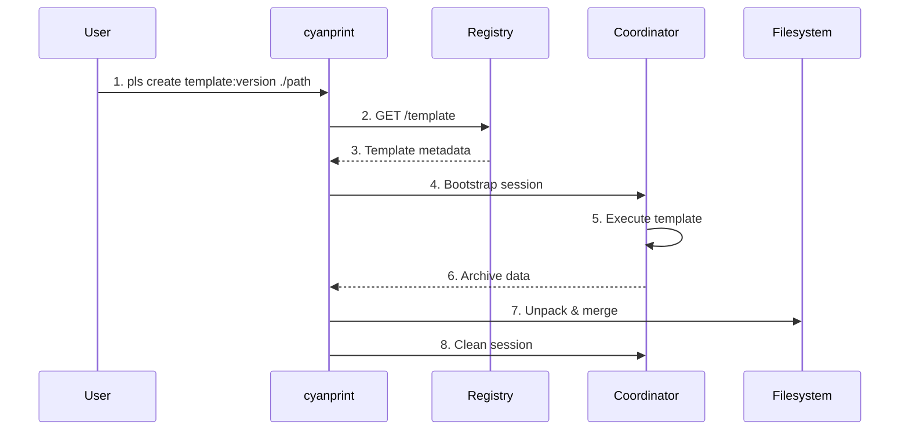
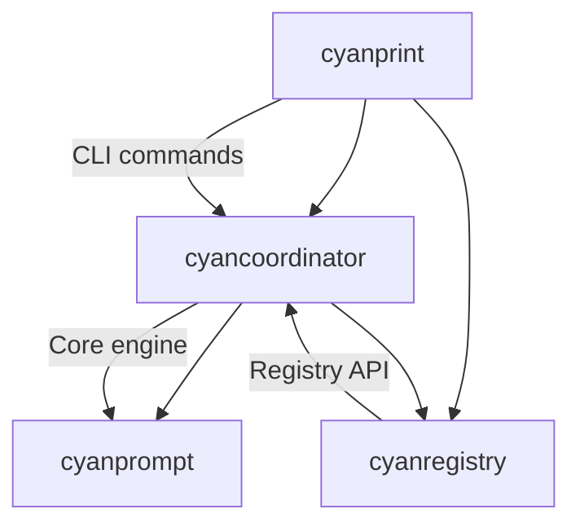
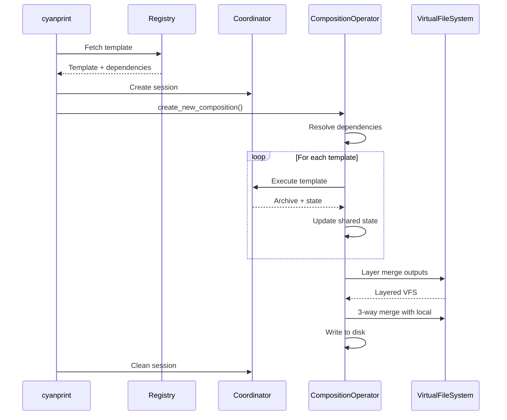
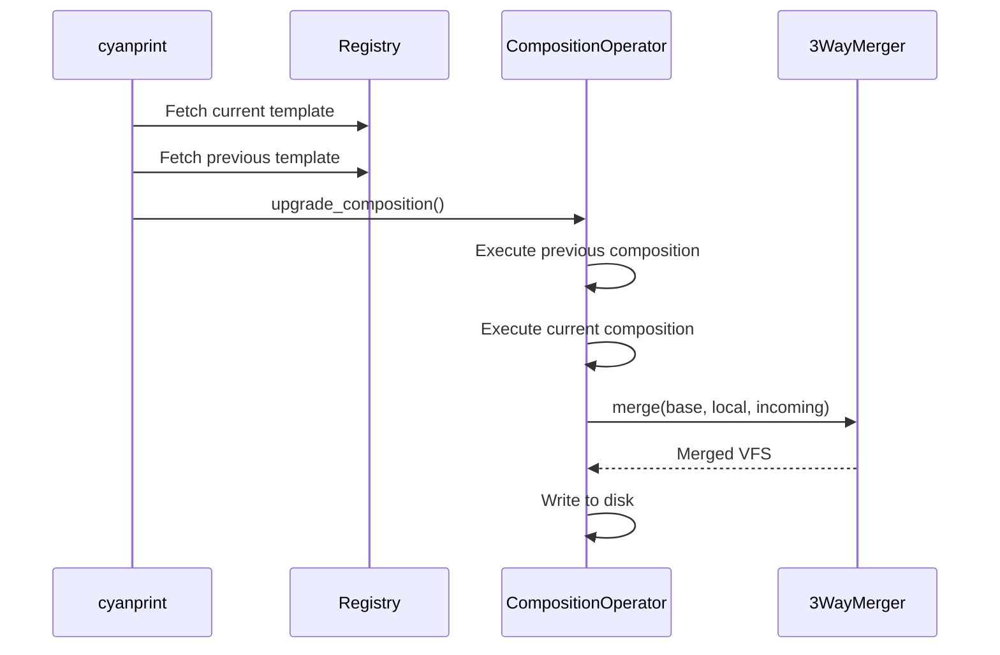

# Architecture

## Overview

Iridium is a template execution system that enables developers to create, share, and compose project templates. The system consists of a CLI client (`cyanprint`) that communicates with a coordinator service to execute templates stored in a central registry. Templates can be single executable units or composed of multiple dependent templates with shared state.

## System Context

### High-Level View

| Component           | Role                                           |
| ------------------- | ---------------------------------------------- |
| User                | Developer running template commands            |
| cyanprint CLI       | Command-line interface for template operations |
| Registry API        | Template storage and metadata service          |
| Coordinator Service | Template execution orchestrator                |
| Template Container  | Isolated execution environment                 |
| Local Filesystem    | Project output and state storage               |

### Component Interaction

| #   | Step              | What                                   | Key File                                    |
| --- | ----------------- | -------------------------------------- | ------------------------------------------- |
| 1   | Create command    | User invokes create command            | `cyanprint/src/main.rs:131`                 |
| 2   | Fetch template    | CLI retrieves template from registry   | `cyanregistry/src/http/client.rs`           |
| 3   | Template metadata | Registry returns template version data | `cyanregistry/src/http/models/`             |
| 4   | Bootstrap         | Start coordinator session              | `cyancoordinator/src/client.rs:bootstrap()` |
| 5   | Execute           | Coordinator runs template in container | `cyancoordinator/src/template/executor.rs`  |
| 6   | Return data       | Archive output returned to CLI         | `cyancoordinator/src/template/executor.rs`  |
| 7   | Write files       | Unpack archive and merge to disk       | `cyancoordinator/src/fs/vfs.rs`             |
| 8   | Cleanup           | Remove session artifacts               | `cyancoordinator/src/client.rs:clean()`     |

## Key Components

| Component                | Purpose                         | Key Files                                                |
| ------------------------ | ------------------------------- | -------------------------------------------------------- |
| **CLI Router**           | Parse and route commands        | `cyanprint/src/main.rs`, `cyanprint/src/commands.rs`     |
| **Template Executor**    | Execute templates in containers | `cyancoordinator/src/template/executor.rs`               |
| **Composition Operator** | Orchestrate multi-template runs | `cyancoordinator/src/operations/composition/operator.rs` |
| **Dependency Resolver**  | Resolve template dependencies   | `cyancoordinator/src/operations/composition/resolver.rs` |
| **VFS Layerer**          | Merge template outputs          | `cyancoordinator/src/operations/composition/layerer.rs`  |
| **3-Way Merger**         | Merge base, local, incoming     | `cyancoordinator/src/fs/merger.rs`                       |
| **State Service**        | Persist template state          | `cyancoordinator/src/state/services.rs`                  |
| **Prompting Engine**     | Handle Q&A with templates       | `cyanprompt/src/domain/services/template/engine.rs`      |

## Key Decisions

### 1. Template Composition via Dependency Graph

**Context**: Templates need to reference and build upon other templates without duplicating content.

**Decision**: Templates declare dependencies as a list of template references. The system uses post-order traversal to execute dependencies first, then dependents.

**Rationale**: Post-order traversal ensures all dependencies are fully materialized before they are needed by dependents. Shared state (answers, deterministic states) flows from dependencies to dependents.

**Key File**: `cyancoordinator/src/operations/composition/resolver.rs`

### 2. 3-Way Merge for Updates

**Context**: Users modify template-generated code. Updates to the template should preserve user changes.

**Decision**: Use git2 library for 3-way merge (base + local + incoming).

**Rationale**: Git's merge algorithm is mature, handles edge cases well, and provides conflict resolution. The base version is what the template originally generated, local is user's current files, incoming is the new template version.

**Key File**: `cyancoordinator/src/fs/merger.rs`

### 3. VFS Layering for Composition

**Context**: Multiple templates in a composition may output the same files. Need deterministic merge behavior.

**Decision**: Simple overlay merge where later templates overwrite earlier ones.

**Rationale**: In post-order execution, "later" templates are higher-level and should override lower-level defaults. This matches user expectations: a web framework template should override a base library template's configuration.

**Key File**: `cyancoordinator/src/operations/composition/layerer.rs`

### 4. Stateful Prompting via Answer Tracking

**Context**: Questions in templates should be asked once and reused across templates.

**Decision**: Track answers by question ID in shared state. Type conflicts abort execution.

**Rationale**: Prevents subtle bugs from type mismatches. Answer tracking enables template composition to feel like a single Q&A session rather than multiple disjointed prompts.

**Key File**: `cyancoordinator/src/operations/composition/state.rs`

### 5. Coordinator Service for Execution

**Context**: Templates may run untrusted code or require isolated environments.

**Decision**: Templates execute in containers managed by a separate coordinator service.

**Rationale**: Security isolation, resource management, and the ability to support different execution environments (Docker, future alternatives). The CLI remains lightweight while the heavy lifting happens in the coordinator.

**Key File**: `cyancoordinator/src/client.rs`

## Crate Architecture

| Crate               | Depends On                    | Purpose                              |
| ------------------- | ----------------------------- | ------------------------------------ |
| **cyanprint**       | cyancoordinator, cyanregistry | CLI entry point and user commands    |
| **cyancoordinator** | cyanprompt, cyanregistry      | Template orchestration and execution |
| **cyanprompt**      | (none)                        | Prompting domain models and services |
| **cyanregistry**    | (none)                        | Registry HTTP client and models      |

## Data Flow

### Template Creation Flow

### Template Update Flow

## Related

- [Concepts](./concepts/) - Domain terminology
- [Features](./features/) - Detailed feature documentation
- [Modules](./modules/) - Code organization details
