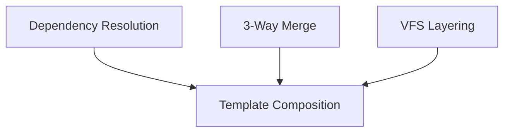

# Algorithms Overview

Implementation details for complex algorithms in Iridium.

## Map

| Algorithm             | Used By              |
| --------------------- | -------------------- |
| Dependency Resolution | Template Composition |
| 3-Way Merge           | Template Updates     |
| VFS Layering          | Template Composition |

## All Algorithms

| Algorithm                                              | Used By              | Description                             |
| ------------------------------------------------------ | -------------------- | --------------------------------------- |
| [Dependency Resolution](./01-dependency-resolution.md) | Template Composition | Post-order traversal of template tree   |
| [3-Way Merge](./02-three-way-merge.md)                 | Template Updates     | Git-like merge with conflict resolution |
| [VFS Layering](./03-vfs-layering.md)                   | Template Composition | Overlay merge of VFS outputs            |

## Groups

### Group 1: Template Execution

- **[Dependency Resolution](./01-dependency-resolution.md)** - Post-order traversal
- **[VFS Layering](./03-vfs-layering.md)** - Overlay merge

### Group 2: File Merging

- **[3-Way Merge](./02-three-way-merge.md)** - Git-like merge
