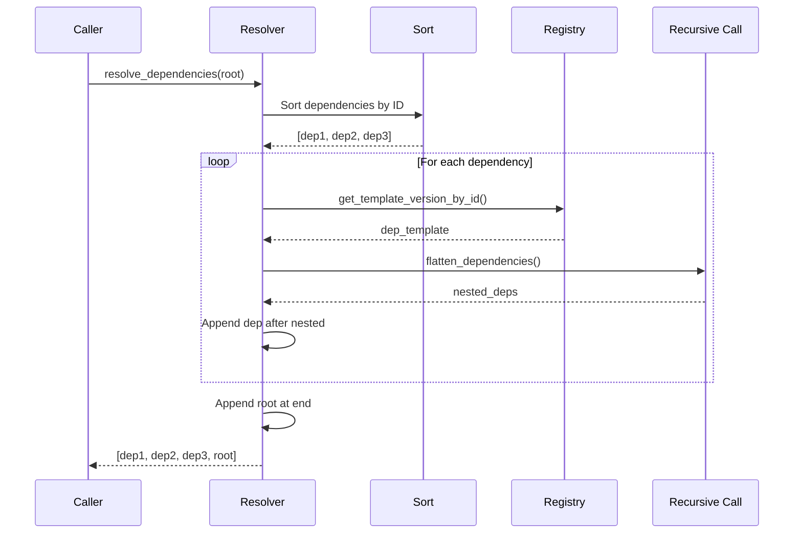

# Dependency Resolution Algorithm

**Used by**:

- [Template Composition](../features/05-template-composition.md)
- [Template Group](../concepts/02-template-group.md)

## Overview

Post-order traversal algorithm that flattens a template dependency tree into a deterministic execution order. Dependencies are sorted by ID before processing to ensure reproducible results.

## Input/Output

| Input      | Type                 | Description                     |
| ---------- | -------------------- | ------------------------------- |
| `template` | `TemplateVersionRes` | Root template with dependencies |
| `visited`  | `&mut Vec<String>`   | Tracking for recursive calls    |

| Output      | Type                      | Description                       |
| ----------- | ------------------------- | --------------------------------- |
| `templates` | `Vec<TemplateVersionRes>` | Flattened list in execution order |

## Steps

<!--
  NOTE FOR REVIEWERS: The diagram intentionally shows "Recurse" as a separate participant
  to represent the recursive flatten_dependencies() call. The public resolve_dependencies()
  method delegates to the private flatten_dependencies() helper for the recursive post-order
  traversal. This design is clearly reflected in the diagram.
-->



| #   | Step              | What                      | Why                            | Key File            |
| --- | ----------------- | ------------------------- | ------------------------------ | ------------------- |
| 1   | Sort dependencies | Order by ID ascending     | Deterministic order            | `resolver.rs:34-35` |
| 2   | Check visited     | Skip if already processed | Prevent infinite recursion     | `resolver.rs:45-47` |
| 3   | Fetch template    | Get from registry         | Access full template data      | `resolver.rs:51-53` |
| 4   | Mark visited      | Add to visited list       | Track processing               | `resolver.rs:61`    |
| 5   | Recursive resolve | Call flatten_dependencies | Handle nested deps             | `resolver.rs:64`    |
| 6   | Append nested     | Add nested deps first     | Post-order: deps before parent | `resolver.rs:65`    |
| 7   | Append self       | Add this dependency       | After its dependencies         | `resolver.rs:68`    |
| 8   | Append root       | Add root template at end  | Root executes last             | `resolver.rs:89`    |

## Detailed Walkthrough

### Step 1: Sort Dependencies

Dependencies are sorted by ID before processing:

```rust
let mut sorted_deps = template.templates.clone();
sorted_deps.sort_by(|a, b| a.id.cmp(&b.id));
```

This ensures templates with multiple dependencies at the same level execute in a predictable order.

**Key File**: `cyancoordinator/src/operations/composition/resolver.rs:34-35`

### Step 2: Check Visited

```rust
if visited.contains(&dep.id) {
    continue;
}
```

Prevents re-processing templates that appear multiple times in the dependency tree.

**Key File**: `cyancoordinator/src/operations/composition/resolver.rs:45-47`

### Step 3-4: Fetch and Mark

```rust
let dep_template = self.registry_client.get_template_version_by_id(dep.id.clone())?;
visited.push(dep.id.clone());
```

Fetch the full template from registry and mark as visited.

**Key File**: `cyancoordinator/src/operations/composition/resolver.rs:51-61`

### Step 5-7: Recursive Flatten

```rust
let mut nested_deps = self.flatten_dependencies(&dep_template, visited)?;
flattened.append(&mut nested_deps);
flattened.push(dep_template);
```

First recursively flatten nested dependencies, then add this template. This is the post-order behavior.

**Key File**: `cyancoordinator/src/operations/composition/resolver.rs:64-68`

### Step 8: Add Root

```rust
flattened.push(template.clone());
```

After all dependencies are processed, add the root template at the end.

**Key File**: `cyancoordinator/src/operations/composition/resolver.rs:89`

## Edge Cases

| Case                 | Input                             | Behavior                             | Key File            |
| -------------------- | --------------------------------- | ------------------------------------ | ------------------- |
| No dependencies      | Empty templates list              | Returns only root                    | `resolver.rs:88-89` |
| Circular reference   | A depends on B, B depends on A    | Visited check prevents infinite loop | `resolver.rs:45-47` |
| Duplicate dependency | A depends on B, C; B depends on C | Visited check skips duplicate        | `resolver.rs:45-47` |
| Nested dependencies  | Multi-level tree                  | Recursive post-order                 | `resolver.rs:64`    |

## Example Execution

Given dependency tree:

```text
root (id: 3)
├── B (id: 1)
│   └── D (id: 4)
└── C (id: 2)
    └── D (id: 4)  # Duplicate
```

Sorted dependencies of root: [B, C] (by ID)

Execution:

1. Process B: recursively process D first, then B → [D, B]
2. Process C: D already visited, skip → [D, B, C]
3. Add root → [D, B, C, root]

## Error Handling

| Error          | Cause                       | Handling             |
| -------------- | --------------------------- | -------------------- |
| Registry error | Network, template not found | Propagated to caller |
| Parse error    | Invalid template data       | Propagated to caller |

## Complexity

- **Time**: O(n + m) where n = number of templates, m = number of dependency edges
- **Space**: O(n) for the flattened list and visited tracking
