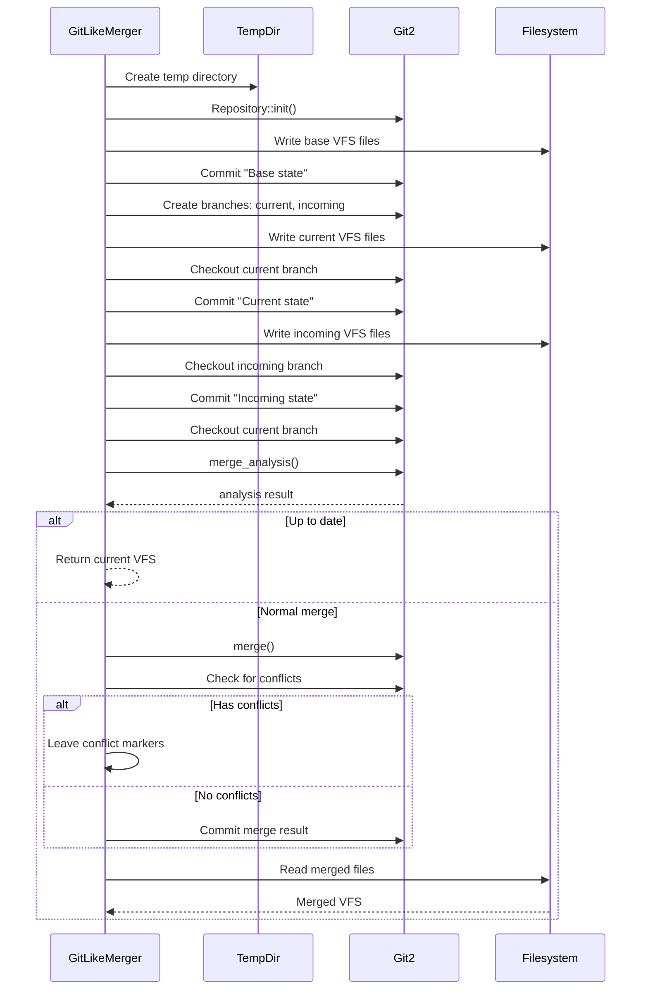

# 3-Way Merge Algorithm

**Used by**:

- [Template Composition](../features/05-template-composition.md) - Upgrade and rerun scenarios
- [3-Way Merge Feature](../features/02-three-way-merge.md)

## Overview

Git-like 3-way merge algorithm using the git2 library. Creates temporary git repository, commits base/current/incoming states, and performs merge to combine changes.

## Input/Output

| Input      | Type                | Description                  |
| ---------- | ------------------- | ---------------------------- |
| `base`     | `VirtualFileSystem` | Original template output     |
| `current`  | `VirtualFileSystem` | User's current files (local) |
| `incoming` | `VirtualFileSystem` | New template output          |

| Output   | Type                | Description        |
| -------- | ------------------- | ------------------ |
| `merged` | `VirtualFileSystem` | Merged file system |

## Steps



| #   | Step             | What                    | Why                        | Key File            |
| --- | ---------------- | ----------------------- | -------------------------- | ------------------- |
| 1   | Create temp repo | Initialize git repo     | Isolated merge environment | `merger.rs:64-92`   |
| 2   | Write base files | Copy VFS to disk        | Establish merge base       | `merger.rs:79-89`   |
| 3   | Commit base      | Create base commit      | Merge ancestor             | `merger.rs:148`     |
| 4   | Create branches  | Set up current/incoming | Prepare for 3-way          | `merger.rs:151-152` |
| 5   | Write current    | Apply local VFS         | Represents user changes    | `merger.rs:173-183` |
| 6   | Commit current   | Save current state      | Current branch             | `merger.rs:186`     |
| 7   | Write incoming   | Apply new VFS           | New template output        | `merger.rs:203-212` |
| 8   | Commit incoming  | Save incoming state     | Incoming branch            | `merger.rs:216`     |
| 9   | Merge analysis   | Check merge type        | Determine strategy         | `merger.rs:240`     |
| 10  | Perform merge    | Git 3-way merge         | Combine changes            | `merger.rs:255`     |
| 11  | Read result      | Convert to VFS          | Return merged output       | `merger.rs:303-333` |

## Detailed Walkthrough

### Step 1-3: Initialize Repository

```rust
let (repo, temp_dir) = self.create_temp_repo(base)?;
let base_commit = self.commit_all(&repo, "Base state")?;
```

Create temporary git repository and commit the base VFS as the initial state.

**Key File**: `cyancoordinator/src/fs/merger.rs:145-148`

### Step 4-6: Setup Current Branch

```rust
repo.branch("current", &repo.find_commit(base_commit)?, false)?;
repo.set_head(current_branch.get().name().unwrap())?;
// Write current VFS, clear existing files
self.commit_all(&repo, "Current state")?;
```

Create branch for current (local) state and commit.

**Key File**: `cyancoordinator/src/fs/merger.rs:151-186`

### Step 7-8: Setup Incoming Branch

```rust
repo.branch("incoming", &repo.find_commit(base_commit)?, false)?;
repo.set_head(incoming_branch.get().name().unwrap())?;
// Write incoming VFS, clear existing files
self.commit_all(&repo, "Incoming state")?;
```

Create branch for incoming (new template) state and commit.

**Key File**: `cyancoordinator/src/fs/merger.rs:189-216`

### Step 9-11: Merge and Read Result

```rust
let analysis = repo.merge_analysis(&[&incoming_annotated])?;
if analysis.0.is_up_to_date() {
    return Ok(current.clone());
} else if analysis.0.is_normal() {
    repo.merge(&[&incoming_annotated], ...)?;
    // Check conflicts, optionally commit
    let result_vfs = self.read_vfs_from_dir(temp_dir.path())?;
    Ok(result_vfs)
}
```

Perform merge and read result back to VFS.

**Key File**: `cyancoordinator/src/fs/merger.rs:240-333`

## Edge Cases

| Case         | Input                          | Behavior                           | Key File            |
| ------------ | ------------------------------ | ---------------------------------- | ------------------- |
| Up to date   | current == incoming            | Return current VFS unchanged       | `merger.rs:242-248` |
| Fast-forward | incoming descends from current | Treated as normal merge            | `merger.rs:249`     |
| Conflicts    | Overlapping changes            | Conflict markers left in files     | `merger.rs:262-268` |
| Empty VFS    | Empty base/current/incoming    | Empty repo created, merge succeeds | `merger.rs:64-92`   |

## Rename Detection

```rust
let mut merge_opts = git2::MergeOptions::new();
merge_opts.find_renames(true);
merge_opts.rename_threshold(self.similarity_threshold);
```

Configurable similarity threshold (0-100) for detecting renamed files during merge.

**Key File**: `cyancoordinator/src/fs/merger.rs:231-233`

## Conflict Handling

When conflicts occur:

- Git inserts standard conflict markers (`<<<<<<<`, `=======`, `>>>>>>>`)
- Files with markers are written to the result VFS
- No merge commit is created
- User must resolve conflicts manually

**Key File**: `cyancoordinator/src/fs/merger.rs:262-268`

## Error Handling

| Error    | Cause                        | Handling              |
| -------- | ---------------------------- | --------------------- |
| GitError | Git operation failed         | Wrapped in MergeError |
| IoError  | File system operation failed | Wrapped in MergeError |
| Other    | Explicit error message       | Wrapped in MergeError |

**Key File**: `cyancoordinator/src/fs/merger.rs:11-47`

## Complexity

- **Time**: O(n log n) for git operations where n = total files
- **Space**: O(n) for temporary repository on disk
