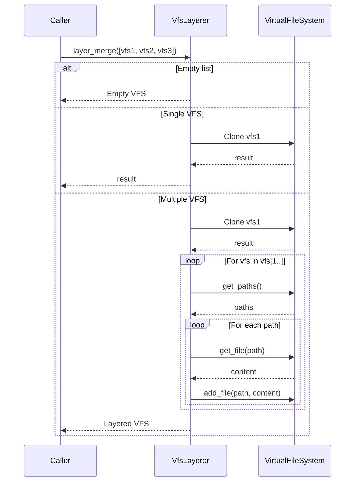

# VFS Layering Algorithm

**Used by**:

- [Template Composition](../features/05-template-composition.md)
- [VFS Layering Feature](../features/03-vfs-layering.md)

## Overview

Simple overlay merge algorithm that combines multiple Virtual File Systems. Later VFS entries overwrite earlier ones for the same path, creating a layered result.

## Input/Output

| Input      | Type                   | Description                        |
| ---------- | ---------------------- | ---------------------------------- |
| `vfs_list` | `&[VirtualFileSystem]` | List of VFS outputs from templates |

| Output   | Type                | Description                        |
| -------- | ------------------- | ---------------------------------- |
| `result` | `VirtualFileSystem` | Layered VFS with overlay semantics |

## Steps



| #   | Step        | What                    | Why                  | Key File           |
| --- | ----------- | ----------------------- | -------------------- | ------------------ |
| 1   | Check empty | Return if no VFS        | Handle edge case     | `layerer.rs:21-23` |
| 2   | Clone first | Start with first VFS    | Establish base layer | `layerer.rs:26`    |
| 3   | Get paths   | Iterate over file paths | Process all files    | `layerer.rs:30`    |
| 4   | Get file    | Retrieve file content   | Access file data     | `layerer.rs:31`    |
| 5   | Add file    | Write to result VFS     | Overlay: later wins  | `layerer.rs:32`    |

## Detailed Walkthrough

### Step 1: Handle Empty List

```rust
if vfs_list.is_empty() {
    return Ok(VirtualFileSystem::new());
}
```

If no VFS outputs (all templates were group templates), return empty VFS.

**Key File**: `cyancoordinator/src/operations/composition/layerer.rs:21-23`

### Step 2: Clone First VFS

```rust
let mut result = vfs_list[0].clone();
```

Start with the first VFS as the base layer.

**Key File**: `cyancoordinator/src/operations/composition/layerer.rs:26`

### Step 3-5: Overlay Subsequent VFS

```rust
for vfs in &vfs_list[1..] {
    for path in vfs.get_paths() {
        if let Some(content) = vfs.get_file(&path) {
            result.add_file(path, content.clone());
        }
    }
}
```

For each subsequent VFS, copy all files to result. Files with the same path overwrite earlier ones.

**Key File**: `cyancoordinator/src/operations/composition/layerer.rs:29-35`

## Layering Semantics

The algorithm follows these rules:

1. Files unique to earlier VFS are preserved
2. Files in later VFS overwrite earlier ones for same path
3. Last VFS wins for conflicting paths
4. Order matters: execution order determines final result

## Example

Given three VFS:

| VFS         | Files                      |
| ----------- | -------------------------- |
| V1 (first)  | `a.txt: "1"`, `b.txt: "1"` |
| V2 (second) | `b.txt: "2"`, `c.txt: "2"` |
| V3 (third)  | `c.txt: "3"`, `d.txt: "3"` |

Layered result:

- `a.txt: "1"` - only in V1
- `b.txt: "2"` - V2 overwrote V1
- `c.txt: "3"` - V3 overwrote V2
- `d.txt: "3"` - only in V3

## Edge Cases

| Case              | Input              | Behavior              | Key File           |
| ----------------- | ------------------ | --------------------- | ------------------ |
| Empty list        | `[]`               | Returns empty VFS     | `layerer.rs:21-23` |
| Single VFS        | `[vfs1]`           | Returns clone of vfs1 | `layerer.rs:26`    |
| No overlap        | All unique paths   | Union of all files    | `layerer.rs:29-35` |
| Complete overlap  | Same paths in all  | Last VFS wins         | `layerer.rs:29-35` |
| Empty VFS in list | Some VFS are empty | Skipped, no effect    | `layerer.rs:30-35` |

## Complexity

- **Time**: O(n × m) where n = number of VFS, m = average files per VFS
- **Space**: O(n × m) worst case for the result VFS (no overlapping paths), O(m) best case (complete overlap)

## Comparison to 3-Way Merge

| Property          | VFS Layering             | 3-Way Merge             |
| ----------------- | ------------------------ | ----------------------- |
| Purpose           | Combine template outputs | Merge with user changes |
| Conflict handling | Last wins                | Conflict markers        |
| Base input        | None                     | Required (ancestor)     |
| Use case          | Composition              | Updates/Reruns          |
