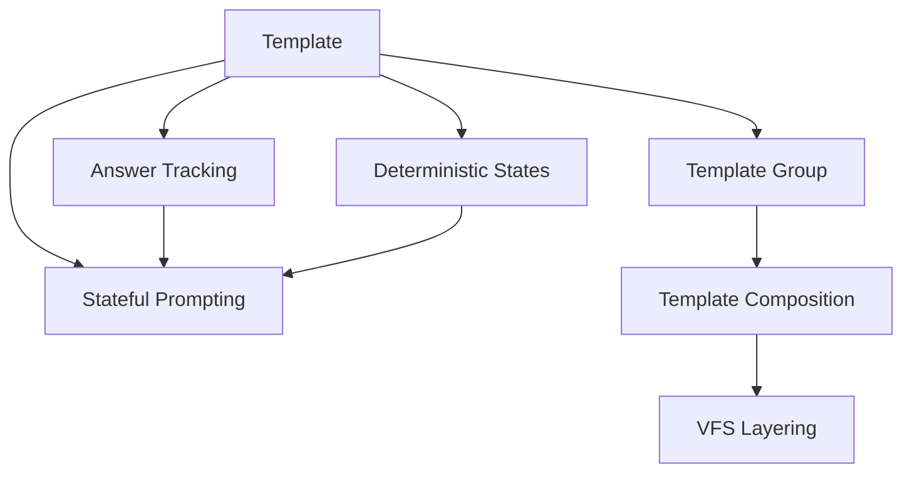

# Concepts Overview

Domain concepts and terminology used in Iridium.

## Map

| Concept              | Role                                       |
| -------------------- | ------------------------------------------ |
| Template             | Executable unit that generates files       |
| Template Group       | Collection of templates with dependencies  |
| Answer Tracking      | Store answers by question ID               |
| Deterministic States | Computed values from template execution    |
| Stateful Prompting   | Q&A flow with answer reuse                 |
| Template Composition | Multi-template execution with shared state |
| VFS Layering         | Overlay merge of template outputs          |

## All Concepts

| Concept                                              | What                             | Why                                 | Key Files                                                |
| ---------------------------------------------------- | -------------------------------- | ----------------------------------- | -------------------------------------------------------- |
| [Template](./01-template.md)                         | Executable or group template     | Core unit for code generation       | `cyanregistry/src/http/models/template_res.rs`           |
| [Template Group](./02-template-group.md)             | Multi-template composition       | Enable reusability and modularity   | `cyancoordinator/src/operations/composition/operator.rs` |
| [Answer Tracking](./03-answer-tracking.md)           | Track answers by question ID     | Reuse answers across templates      | `cyancoordinator/src/operations/composition/state.rs`    |
| [Deterministic States](./04-deterministic-states.md) | Computed execution state         | Enable deterministic regeneration   | `cyanprompt/src/domain/services/template/states.rs`      |
| [Stateful Prompting](./05-stateful-prompting.md)     | Q&A with state management        | Single Q&A session for compositions | `cyanprompt/src/domain/services/template/engine.rs`      |
| [Template Composition](./06-template-composition.md) | Multi-template with shared state | Complex, layered templates          | `cyancoordinator/src/operations/composition/operator.rs` |
| [VFS Layering](./07-vfs-layering.md)                 | Overlay file system merge        | Combine multiple template outputs   | `cyancoordinator/src/operations/composition/layerer.rs`  |
| [Properties Field](./08-properties-field.md)         | Template execution artifacts     | Determine executable vs group       | `cyanregistry/src/http/models/template_res.rs`           |

## Groups

### Group 1: Template Types

- **[Template](./01-template.md)** - Executable and group templates
- **[Template Group](./02-template-group.md)** - Composition of templates
- **[Properties Field](./08-properties-field.md)** - Execution artifact configuration

### Group 2: State Management

- **[Answer Tracking](./03-answer-tracking.md)** - Question/answer storage
- **[Deterministic States](./04-deterministic-states.md)** - Computed state
- **[Stateful Prompting](./05-stateful-prompting.md)** - Q&A with state

### Group 3: Composition

- **[Template Composition](./06-template-composition.md)** - Multi-template execution
- **[VFS Layering](./07-vfs-layering.md)** - Output merging
