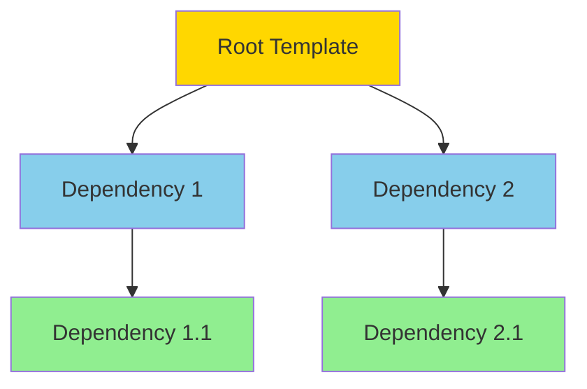

# Template Group

**What**: A template group is a composition of multiple templates with dependencies.

**Why**: Enables modularity and reusability by allowing templates to build upon each other.

**Key Files**:

- `cyancoordinator/src/operations/composition/operator.rs` → `CompositionOperator`
- `cyancoordinator/src/operations/composition/resolver.rs` → `resolve_dependencies()`

## Overview

A template group declares a list of template dependencies. When executed, the system:

1. Resolves all dependencies using post-order traversal
2. Executes each template in order
3. Shares answers and state across templates
4. Merges outputs using VFS layering

## Dependency Declaration

Templates declare dependencies in their metadata. The resolver traverses the dependency graph to determine execution order.

**Key File**: `cyancoordinator/src/operations/composition/resolver.rs`

## Execution Flow

Green = leaf nodes (executed first), Blue = intermediate, Gold = root (executed last)

## Shared State

All templates in a group share:

- **Answers** - User responses to questions (by question ID)
- **Deterministic states** - Computed values from execution

This allows a higher-level template to reference answers from dependencies.

**Key File**: `cyancoordinator/src/operations/composition/state.rs` → `CompositionState`

## Group Template vs Executable

| Property              | Group Template                 | Executable Template     |
| --------------------- | ------------------------------ | ----------------------- |
| `properties` field    | `None`                         | Present (Docker images) |
| Generates files       | No (via dependencies)          | Yes                     |
| Can have dependencies | Yes                            | Yes                     |
| Execution             | Skipped, only metadata tracked | Runs in container       |

## Related

- [Template](./01-template.md) - Template types
- [Template Composition](./06-template-composition.md) - Composition execution
- [VFS Layering](./07-vfs-layering.md) - Output merging
- [Dependency Resolution](../features/01-dependency-resolution.md) - Resolution algorithm
