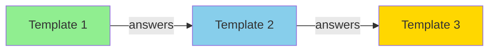

# Answer Tracking

**What**: Answer tracking stores user responses keyed by question ID for reuse across template executions.

**Why**: Enables templates to be re-run or updated without re-asking questions, and allows answers to be shared between templates in a composition.

**Key Files**:

- `cyanprompt/src/domain/models/answer.rs` → `Answer`
- `cyancoordinator/src/operations/composition/state.rs` → `CompositionState`
- `cyancoordinator/src/state/services.rs` → `save_template_metadata()`

## Overview

When a template prompts the user, each question has a unique ID. The user's answer is stored in a map:

```rust
HashMap<String, Answer>
```

## Answer Types

**Key File**: `cyanprompt/src/domain/models/answer.rs`

| Type          | Description          | Example Value              |
| ------------- | -------------------- | -------------------------- |
| `String`      | Single text value    | `"my-project"`             |
| `StringArray` | Multiple text values | `["feature1", "feature2"]` |
| `Bool`        | Boolean value        | `true`                     |

## Storage

Answers are persisted in `.cyan_state.yaml`:

```yaml
templates:
  username/template-name:
    history:
      - version: 1
        answers:
          project-name: 'my-project'
          features: ['auth', 'api']
          use-typescript: true
```

**Key File**: `cyancoordinator/src/state/services.rs`

## Shared State in Composition

In a template composition, answers flow from dependencies to dependents:



**Key File**: `cyancoordinator/src/operations/composition/state.rs` → `update_from_template_state()`

## Type Conflict Detection

When merging answers across templates, the system validates type consistency. If two templates produce different types for the same question ID, execution aborts:

```rust
if discriminant(existing) != discriminant(value) {
    panic!(
        "Type conflict for key '{key}': existing type differs from new type"
    );
}
```

**Key File**: `cyancoordinator/src/operations/composition/state.rs:35`

## Related

- [Stateful Prompting](./05-stateful-prompting.md) - Q&A flow with answers
- [Deterministic States](./04-deterministic-states.md) - Computed state
- [Template Composition](./06-template-composition.md) - Shared state in compositions
