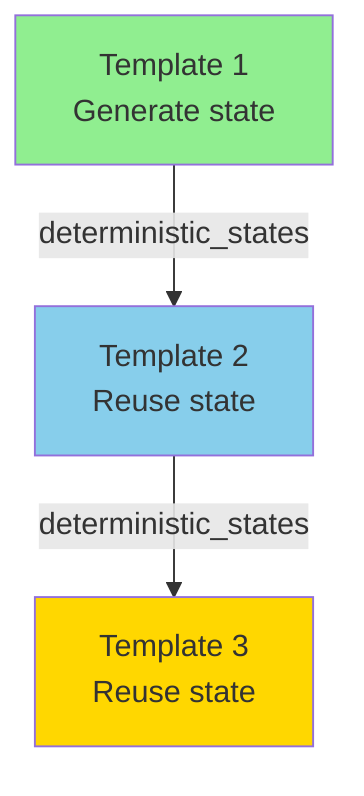

# Deterministic States

**What**: Deterministic states are computed values generated during template execution that can be replayed to regenerate identical output.

**Why**: Enables templates to be re-run or updated without re-executing non-deterministic operations, while still producing consistent output.

**Key Files**:

- `cyanprompt/src/domain/services/template/states.rs` → `TemplateState`
- `cyancoordinator/src/operations/composition/state.rs` → `shared_deterministic_states`

## Overview

During template execution, some operations may produce non-deterministic results (e.g., timestamps, random values). Deterministic states capture these values so they can be replayed in future runs.

## Storage

Deterministic states are stored alongside answers in `.cyan_state.yaml`:

```yaml
templates:
  username/template-name:
    history:
      - version: 1
        answers:
          project-name: 'my-project'
        deterministic_states:
          timestamp: '2024-01-15T10:30:00Z'
          random-id: 'abc123def'
```

**Key File**: `cyancoordinator/src/state/services.rs`

## Shared State in Composition

Like answers, deterministic states flow through template compositions:



**Key File**: `cyancoordinator/src/operations/composition/state.rs`

## CompositionState Structure

```rust
pub struct CompositionState {
    pub shared_answers: HashMap<String, Answer>,
    pub shared_deterministic_states: HashMap<String, String>,
    pub execution_order: Vec<String>,
}
```

**Key File**: `cyancoordinator/src/operations/composition/state.rs`

## Use Cases

1. **Template Updates** - Preserve computed values when upgrading template versions
2. **Template Reruns** - Regenerate with same deterministic values
3. **Composition** - Share computed values between dependent templates

## Related

- [Answer Tracking](./03-answer-tracking.md) - User-provided answers
- [Stateful Prompting](./05-stateful-prompting.md) - Q&A with state
- [Template Composition](./06-template-composition.md) - Multi-template execution
