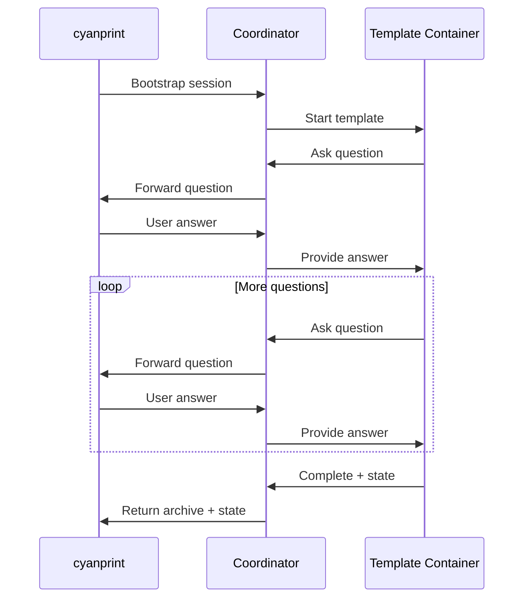
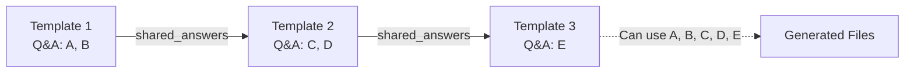

# Stateful Prompting

**What**: Stateful prompting is a Q&A flow where answers and deterministic states are tracked and reused across template executions.

**Why**: Creates a seamless experience where users answer questions once and answers propagate through template compositions.

**Key Files**:

- `cyanprompt/src/domain/services/template/engine.rs` → `TemplateEngine`
- `cyancoordinator/src/template/executor.rs` → `execute_template()`

## Overview

When a template runs, it may prompt the user for input. The prompting engine:

1. Sends questions to the template server (via coordinator)
2. Receives answers from the user
3. Tracks answers by question ID
4. Returns complete state for persistence

## Template States

**Key File**: `cyanprompt/src/domain/services/template/states.rs`

```rust
pub enum TemplateState {
    QnA,                      // Still prompting
    Complete(Cyan, HashMap<String, Answer>),  // Done with answers
    Err(String),              // Error occurred
}
```

## Execution Flow



## Pre-filled Answers

When re-running or updating a template, previous answers are provided to skip questions:

```rust
execute_template(
    template,
    session_id,
    Some(&shared_answers),           // Pre-fill existing answers
    Some(&shared_deterministic_states),  // Pre-fill deterministic states
)
```

**Key File**: `cyancoordinator/src/template/executor.rs`

## Shared State in Composition

In template compositions, answers from earlier templates are available to later templates:



**Key File**: `cyancoordinator/src/operations/composition/operator.rs` → `execute_composition()`

## Related

- [Answer Tracking](./03-answer-tracking.md) - Answer storage
- [Deterministic States](./04-deterministic-states.md) - Computed state storage
- [Template Composition](./06-template-composition.md) - Multi-template Q&A flow
- [Stateful Prompting Feature](../features/06-stateful-prompting.md) - Feature details
