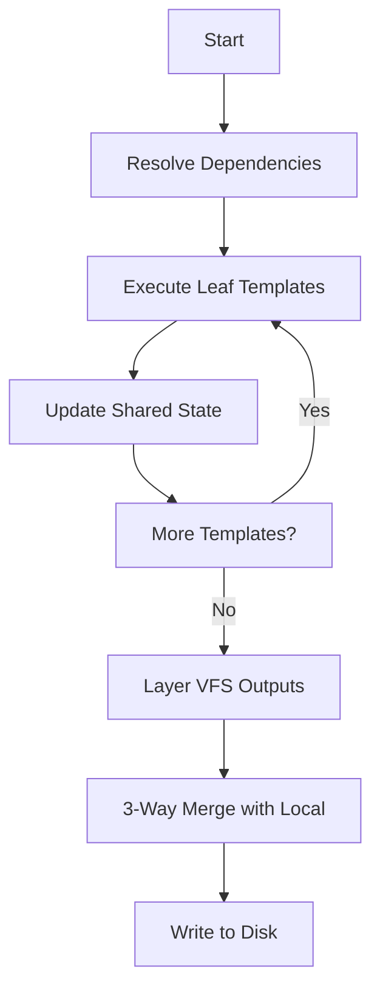
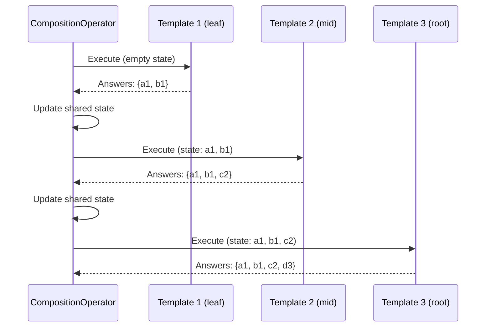

# Template Composition

**What**: Template composition executes multiple templates in dependency order with shared answers and deterministic states.

**Why**: Enables complex, layered templates where higher-level templates build upon lower-level ones.

**Key Files**:

- `cyancoordinator/src/operations/composition/operator.rs` → `CompositionOperator`
- `cyancoordinator/src/operations/composition/resolver.rs` → `resolve_dependencies()`

## Overview

Template composition allows templates to depend on other templates. When executed:

1. Dependencies are resolved using post-order traversal
2. Each template executes in order
3. Answers and states flow from dependencies to dependents
4. Outputs are merged using VFS layering

## Example Composition

```
web-framework-template/
├── Depends on: base-library-template
├── Adds: web server files
└── Overrides: base configuration
```

## Execution Flow



## Shared State Flow



## Key Behaviors

| Behavior                 | Description                                                 |
| ------------------------ | ----------------------------------------------------------- |
| **Skip group templates** | Templates without `properties` are tracked but not executed |
| **Answer accumulation**  | Answers from earlier templates available to later ones      |
| **Type validation**      | Conflicts abort execution                                   |
| **VFS layering**         | Later templates overwrite earlier ones for same paths       |

**Key File**: `cyancoordinator/src/operations/composition/operator.rs:34-99`

## Create vs Upgrade vs Rerun

| Scenario    | Base             | Incoming             | Answers                |
| ----------- | ---------------- | -------------------- | ---------------------- |
| **New**     | Empty            | Template composition | Fresh Q&A              |
| **Upgrade** | Previous version | New version          | Reuse + prompt for new |
| **Rerun**   | Previous version | Same version         | Fresh Q&A              |

**Key File**: `cyancoordinator/src/operations/composition/operator.rs`

## Related

- [Template Group](./02-template-group.md) - Composition via dependencies
- [VFS Layering](./07-vfs-layering.md) - Output merging
- [Answer Tracking](./03-answer-tracking.md) - Shared answers
- [Template Composition Feature](../features/05-template-composition.md) - Feature details
