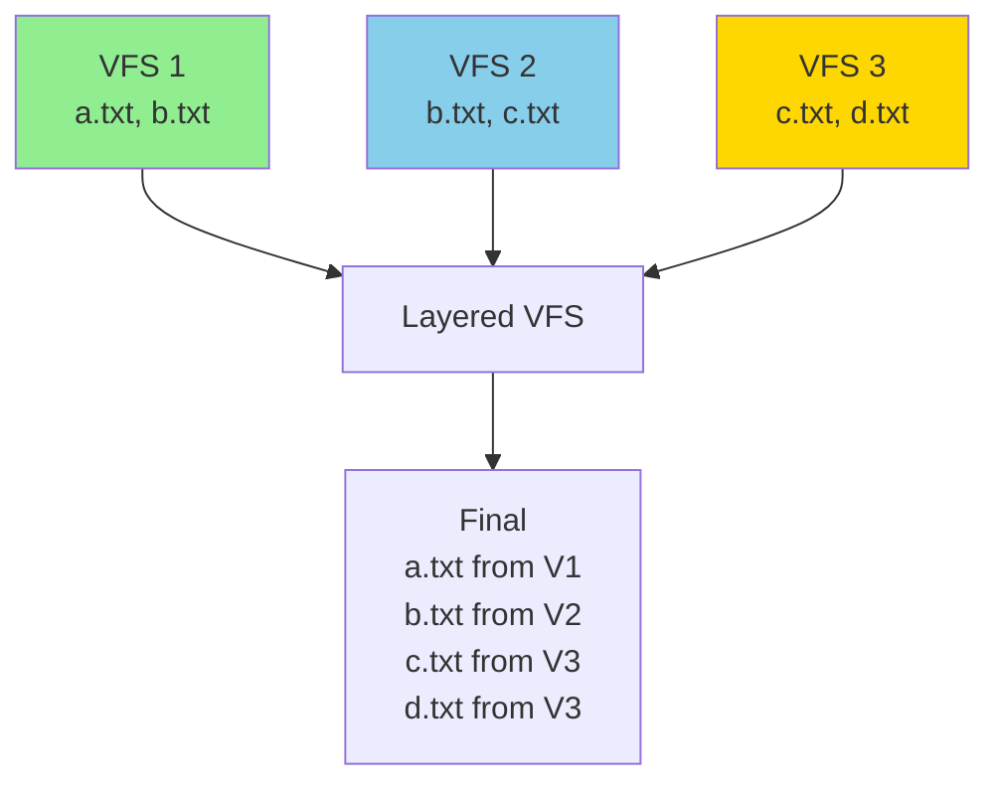
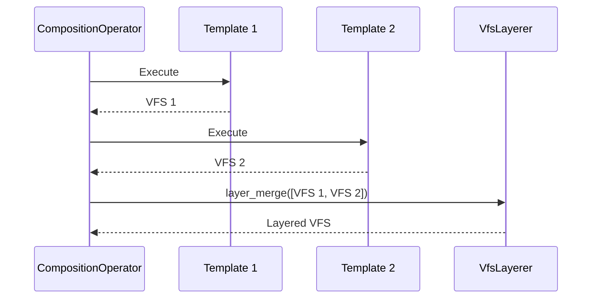

# VFS Layering

**What**: VFS layering merges multiple virtual file systems using overlay semantics (later files overwrite earlier ones).

**Why**: Combines outputs from multiple templates in a composition deterministically.

**Key Files**:

- `cyancoordinator/src/operations/composition/layerer.rs` → `VfsLayerer`
- `cyancoordinator/src/fs/vfs.rs` → `VirtualFileSystem`

## Overview

The Virtual File System (VFS) is an in-memory representation of files. When multiple templates execute in a composition, each produces a VFS. VFS layering combines these into a single VFS.

## Layering Semantics



**Rule**: Later templates override earlier templates for the same file path.

**Key File**: `cyancoordinator/src/operations/composition/layerer.rs`

## Virtual File System

```rust
pub struct VirtualFileSystem {
    pub(crate) files: HashMap<PathBuf, Vec<u8>>,
}
```

**Key File**: `cyancoordinator/src/fs/vfs.rs`

## Layering Process

1. Create empty VFS
2. For each template's VFS in execution order:
   - Copy all files to layered VFS
   - Overwrite existing paths
3. Return layered VFS

**Key File**: `cyancoordinator/src/operations/composition/layerer.rs`

## Example

Given three templates with outputs:

| Template  | Files                              |
| --------- | ---------------------------------- |
| T1 (base) | `config/default.yaml`, `README.md` |
| T2 (web)  | `config/default.yaml`, `server.rs` |
| T3 (api)  | `routes.rs`                        |

Layered result:

- `config/default.yaml` - from T3 (overwrites T2, which overwrote T1)
- `README.md` - from T1
- `server.rs` - from T2
- `routes.rs` - from T3

## Use in Composition

VFS layering is the final step after all templates execute:



**Key File**: `cyancoordinator/src/operations/composition/operator.rs:89-96`

## Related

- [Template Composition](./06-template-composition.md) - Multi-template execution
- [3-Way Merge](../features/02-three-way-merge.md) - Merge with user changes
- [VFS Layering Feature](../features/03-vfs-layering.md) - Feature details
