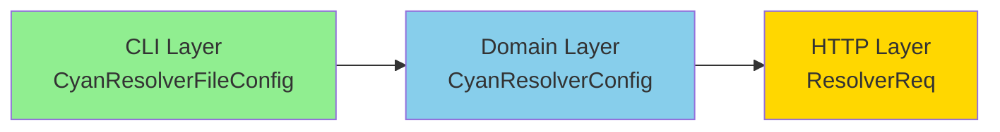
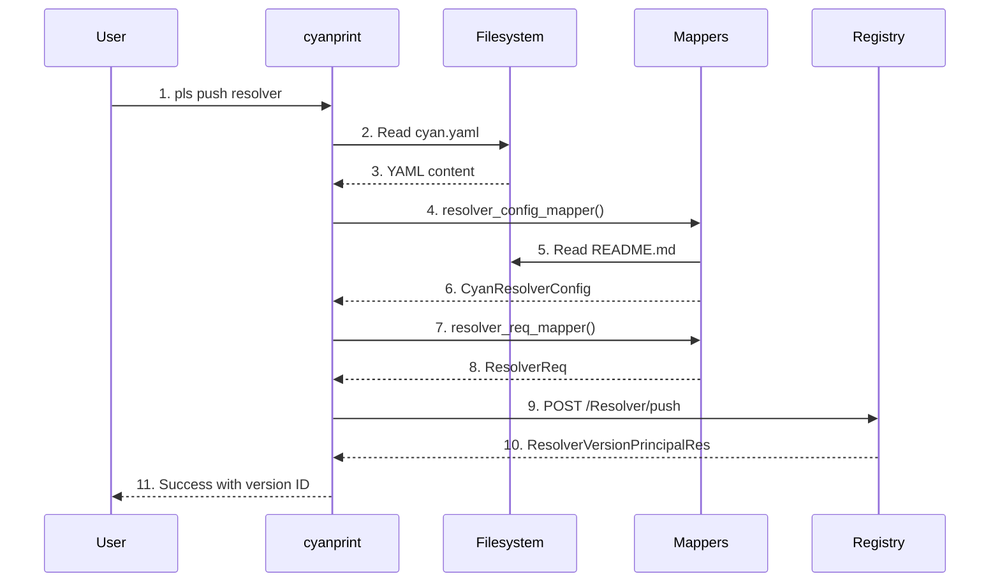

# Resolver

**What**: A resolver is a conflict resolution artifact that resolves merge conflicts during template updates.

**Why**: Resolvers enable automated conflict resolution when applying template updates to existing projects.

**Key Files**:

- `cyanregistry/src/http/models/resolver_req.rs` → `ResolverReq`
- `cyanregistry/src/http/models/resolver_res.rs` → `ResolverVersionPrincipalRes`
- `cyanregistry/src/http/client.rs:207-220` → `push_resolver()`

## Overview

A resolver is a Docker-based artifact that resolves conflicts during template updates. When the 3-way merge algorithm detects conflicts between previous and current template versions, a resolver can automatically merge them based on custom logic.

Resolvers follow the same 3-layer pattern as plugins and processors:



## Resolver Reference Format

Resolvers are referenced using the format:

```text
<username>/<resolver-name>:<version>
```

Example:

```text
cyane2e/json-merger:1
```

## Configuration File

Resolver configuration in `cyan.yaml`:

```yaml
username: cyane2e
name: json-merger
description: Deep merge JSON files with conflict resolution
project: atomi
source: github.com/atomi/resolvers
email: dev@atomi.com
tags:
  - json
  - merge
readme: README.md
```

**Key File**: `cyanregistry/src/cli/models/resolver_config.rs` → `CyanResolverFileConfig`

## 3-Layer Pattern

### CLI Layer

Parses YAML configuration file:

```rust
pub struct CyanResolverFileConfig {
    pub username: String,
    pub name: String,
    pub description: String,
    pub project: String,
    pub source: String,
    pub email: String,
    pub tags: Vec<String>,
    pub readme: String,  // Path to README file
}
```

**Key File**: `cyanregistry/src/cli/models/resolver_config.rs`

### Domain Layer

In-memory representation with resolved content:

```rust
pub struct CyanResolverConfig {
    pub username: String,
    pub name: String,
    pub description: String,
    pub project: String,
    pub source: String,
    pub email: String,
    pub tags: Vec<String>,
    pub readme: String,  // Actual README content
}
```

**Key File**: `cyanregistry/src/domain/config/resolver_config.rs`

### HTTP Layer

API request structure:

```rust
pub struct ResolverReq {
    pub name: String,
    pub project: String,
    pub source: String,
    pub email: String,
    pub tags: Vec<String>,
    pub description: String,
    pub readme: String,
    pub version_description: String,
    pub docker_reference: String,
    pub docker_tag: String,
}
```

**Key File**: `cyanregistry/src/http/models/resolver_req.rs`

## Push Flow



| #   | Step             | What                                         | Key File                          |
| --- | ---------------- | -------------------------------------------- | --------------------------------- |
| 1   | Parse command    | Parse CLI arguments                          | `cyanprint/src/main.rs`           |
| 2   | Load config      | Read YAML file                               | `cyanregistry/src/cli/mapper.rs`  |
| 4-5 | Map to domain    | Parse and read README                        | `resolver_config_mapper()`        |
| 7-8 | Map to HTTP      | Create API request                           | `cyanregistry/src/http/mapper.rs` |
| 9   | Push to registry | POST to `/api/v{v}/Resolver/push/{username}` | `client.rs`                       |
| 10  | Return version   | Registry assigns version ID                  | `ResolverVersionPrincipalRes`     |

## API Endpoint

**POST** `/api/v{version}/Resolver/push/{username}`

Request body:

```json
{
  "name": "json-merger",
  "project": "atomi",
  "source": "github.com/atomi/resolvers",
  "email": "dev@atomi.com",
  "tags": ["json", "merge"],
  "description": "Deep merge JSON files",
  "readme": "# JSON Merger\n\nMerges JSON files...",
  "versionDescription": "Initial version",
  "dockerReference": "atomi/json-merger",
  "dockerTag": "1.0.0"
}
```

Response: `ResolverVersionPrincipalRes`

## Resolver vs Plugin vs Processor

| Artifact  | Purpose                      | Used During        |
| --------- | ---------------------------- | ------------------ |
| Resolver  | Merge conflict resolution    | Template update    |
| Plugin    | Extend template prompts      | Template execution |
| Processor | Post-process generated files | After template run |

## Related

- [push Command](../surfaces/cli/01-push.md) - CLI push subcommands
- [3-Way Merge](../features/02-three-way-merge.md) - Merge algorithm
- [Template Composition](./06-template-composition.md) - Template orchestration
