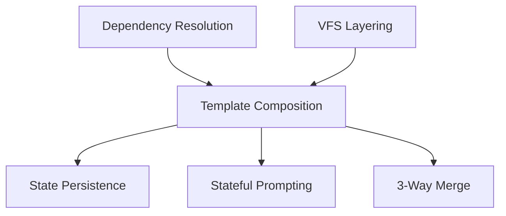

# Features Overview

Complex capabilities and services in Iridium.

## Map

| Feature               | Role                                       |
| --------------------- | ------------------------------------------ |
| Dependency Resolution | Resolve template dependencies in order     |
| 3-Way Merge           | Merge base, local, incoming changes        |
| VFS Layering          | Overlay merge for composition outputs      |
| State Persistence     | Store template state in `.cyan_state.yaml` |
| Template Composition  | Multi-template orchestration               |
| Stateful Prompting    | Q&A flow with answer tracking              |

## All Features

| Feature                                                | What                                  | Why                                  | Key Files                                                |
| ------------------------------------------------------ | ------------------------------------- | ------------------------------------ | -------------------------------------------------------- |
| [Dependency Resolution](./01-dependency-resolution.md) | Post-order traversal of template tree | Deterministic execution order        | `cyancoordinator/src/operations/composition/resolver.rs` |
| [3-Way Merge](./02-three-way-merge.md)                 | Git-like merge algorithm              | Preserve user changes during updates | `cyancoordinator/src/fs/merger.rs`                       |
| [VFS Layering](./03-vfs-layering.md)                   | Overlay merge of VFS outputs          | Combine template outputs             | `cyancoordinator/src/operations/composition/layerer.rs`  |
| [State Persistence](./04-state-persistence.md)         | Store state in `.cyan_state.yaml`     | Enable template updates and reruns   | `cyancoordinator/src/state/services.rs`                  |
| [Template Composition](./05-template-composition.md)   | Multi-template orchestration          | Complex, layered templates           | `cyancoordinator/src/operations/composition/operator.rs` |
| [Stateful Prompting](./06-stateful-prompting.md)       | Answer tracking by question ID        | Reuse answers across runs            | `cyanprompt/src/domain/services/template/engine.rs`      |

## Groups

### Group 1: Template Execution

- **[Dependency Resolution](./01-dependency-resolution.md)** - Resolve template order
- **[Template Composition](./05-template-composition.md)** - Multi-template orchestration
- **[Stateful Prompting](./06-stateful-prompting.md)** - Q&A with state

### Group 2: File Merging

- **[VFS Layering](./03-vfs-layering.md)** - Overlay merge
- **[3-Way Merge](./02-three-way-merge.md)** - Git-like merge with conflicts

### Group 3: State Management

- **[State Persistence](./04-state-persistence.md)** - Store in `.cyan_state.yaml`
- **[Stateful Prompting](./06-stateful-prompting.md)** - Q&A with state
