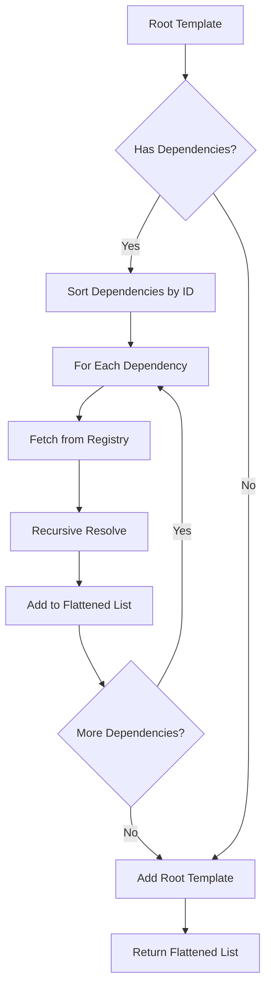
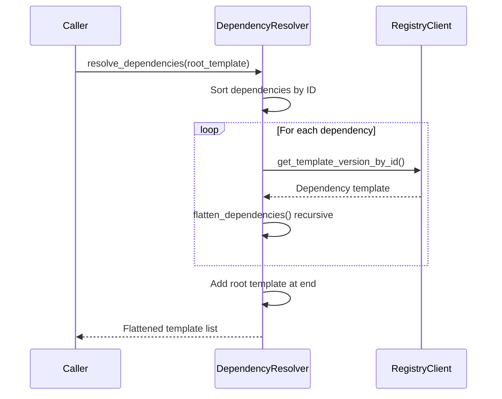

# Dependency Resolution

**What**: Post-order traversal of the template dependency tree to determine execution order.

**Why**: Ensures dependencies are fully materialized before dependents, with deterministic ordering.

**Key Files**:

- `cyancoordinator/src/operations/composition/resolver.rs` → `DependencyResolver`
- `cyancoordinator/src/operations/composition/resolver.rs` → `flatten_dependencies()`

## Overview

Templates can declare dependencies on other templates. The dependency resolver uses post-order traversal to determine the execution order: dependencies execute before dependents.

## Flow

### High-Level



### Detailed



| #   | Step              | What                                  | Why                             | Key File            |
| --- | ----------------- | ------------------------------------- | ------------------------------- | ------------------- |
| 1   | Sort dependencies | Order by ID for determinism           | Ensure reproducible execution   | `resolver.rs:34-35` |
| 2   | Fetch template    | Get full template from registry       | Access dependency metadata      | `resolver.rs:51-53` |
| 3   | Recursive resolve | Process nested dependencies           | Handle multi-level dependencies | `resolver.rs:64`    |
| 4   | Add flattened     | Append after nested deps (post-order) | Dependencies before dependents  | `resolver.rs:68`    |
| 5   | Add root          | Append root template at end           | Root executes last              | `resolver.rs:89`    |

## Deterministic Ordering

Dependencies are sorted by ID before processing:

```rust
sorted_deps.sort_by(|a, b| a.id.cmp(&b.id));
```

This ensures that templates with multiple dependencies at the same level execute in a predictable order.

**Key File**: `cyancoordinator/src/operations/composition/resolver.rs:35`

## Example Execution Order

Given this dependency tree:

```
root (depends on: B, C)
├── B (depends on: D)
└── C (depends on: D)
```

Post-order traversal produces: D, B, C, root

## Edge Cases

- **Circular dependencies**: Not detected - visited list prevents infinite recursion
- **Duplicate dependencies**: Visited tracking prevents re-processing
- **Empty dependencies**: Root template executes alone

## Algorithm Details

For implementation details, see: [Dependency Resolution Algorithm](../algorithms/01-dependency-resolution.md)

## Related

- [Template Composition](./05-template-composition.md) - Uses resolved dependencies
- [Template Group](../concepts/02-template-group.md) - Dependencies concept
