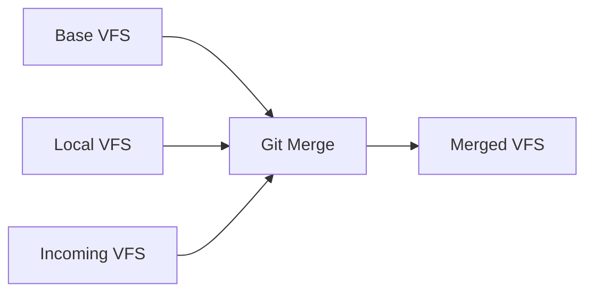
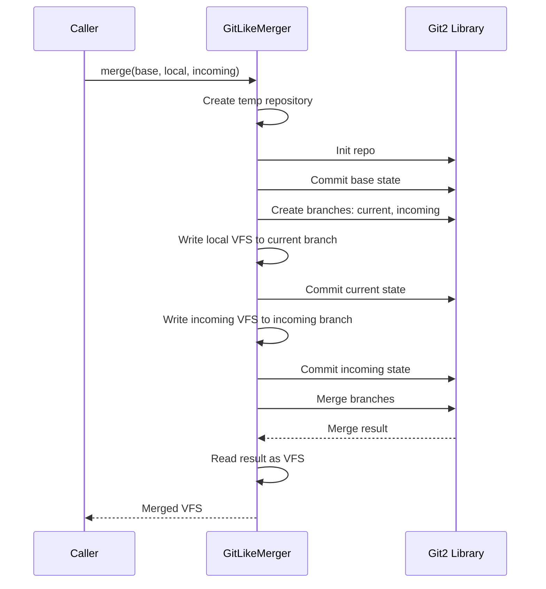

# 3-Way Merge

**What**: Git-like 3-way merge algorithm for combining base, local, and incoming file changes.

**Why**: Preserves user modifications when updating template-generated code.

**Key Files**:

- `cyancoordinator/src/fs/merger.rs` → `GitLikeMerger`
- `cyancoordinator/src/fs/merger.rs` → `perform_git_merge()`

## Overview

When updating a template, the system performs a 3-way merge:

- **Base**: What the template originally generated
- **Local**: User's current files (may have modifications)
- **Incoming**: New template version output

## Flow

### High-Level



### Detailed



| #   | Step               | What                        | Why                         | Key File            |
| --- | ------------------ | --------------------------- | --------------------------- | ------------------- |
| 1   | Create temp repo   | Initialize git repository   | Use git for merge algorithm | `merger.rs:64-76`   |
| 2   | Commit base        | Create base commit          | Establish merge ancestor    | `merger.rs:148`     |
| 3   | Create branches    | Set up current and incoming | Prepare for 3-way merge     | `merger.rs:151-152` |
| 4   | Write local VFS    | Apply local files           | Represents user changes     | `merger.rs:173-183` |
| 5   | Commit current     | Save current state          | Current branch ready        | `merger.rs:186`     |
| 6   | Write incoming VFS | Apply incoming files        | New template output         | `merger.rs:203-213` |
| 7   | Commit incoming    | Save incoming state         | Incoming branch ready       | `merger.rs:216`     |
| 8   | Merge              | Git 3-way merge             | Combine all changes         | `merger.rs:255`     |
| 9   | Read result        | Convert to VFS              | Return merged output        | `merger.rs:293`     |

## Rename Detection

The merger supports rename detection with configurable similarity threshold:

```rust
merge_opts.rename_threshold(self.similarity_threshold);
```

**Key File**: `cyancoordinator/src/fs/merger.rs:233`

## Conflict Handling

When conflicts occur:

- Git's conflict markers are left in the files
- Files are written to disk with conflict markers
- User must resolve conflicts manually

**Key File**: `cyancoordinator/src/fs/merger.rs:262-268`

## Use Cases

| Scenario                  | Base         | Local        | Incoming        |
| ------------------------- | ------------ | ------------ | --------------- |
| **New template**          | Empty        | Empty        | Template output |
| **Update (no changes)**   | Old template | Old template | New template    |
| **Update (with changes)** | Old template | Modified     | New template    |
| **Rerun**                 | Old template | Modified     | Same template   |

## Edge Cases

- **Empty VFS**: Handled as git repository with no files
- **No changes**: Merge analysis returns up-to-date
- **Conflicts**: Conflict markers left in files

## Algorithm Details

For implementation details, see: [3-Way Merge Algorithm](../algorithms/02-three-way-merge.md)

## Related

- [VFS Layering](./03-vfs-layering.md) - Composition output merging
- [State Persistence](./04-state-persistence.md) - Stores template versions
- [Template Composition](./05-template-composition.md) - Uses 3-way merge for updates
