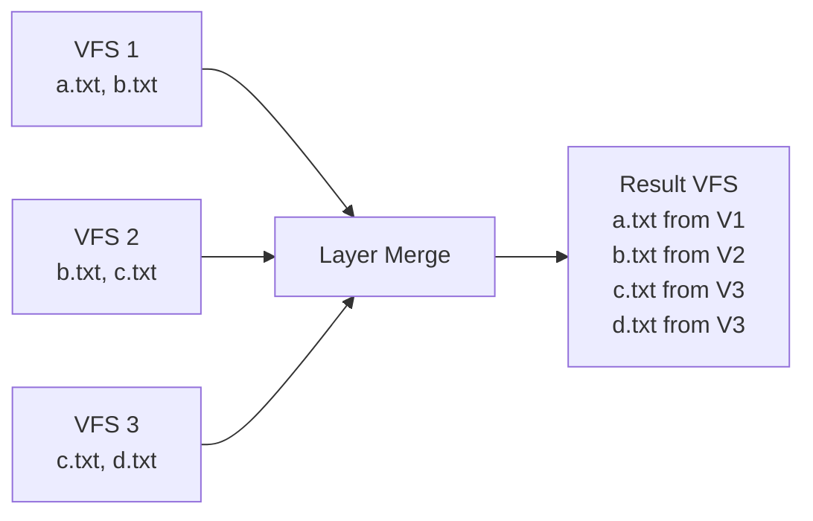
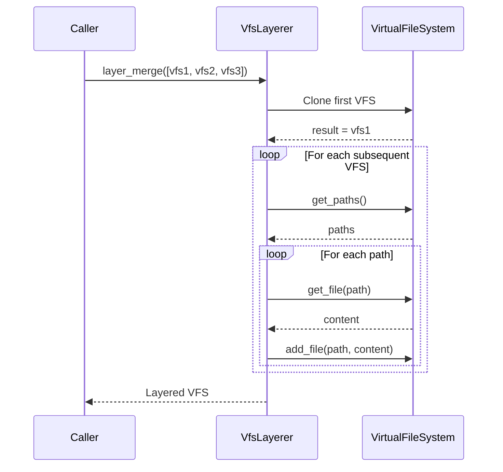

# VFS Layering

**What**: Overlay merge of multiple Virtual File System outputs where later templates overwrite earlier ones.

**Why**: Combines outputs from template composition deterministically.

**Key Files**:

- `cyancoordinator/src/operations/composition/layerer.rs` → `VfsLayerer`
- `cyancoordinator/src/operations/composition/layerer.rs` → `layer_merge()`
- `cyancoordinator/src/fs/vfs.rs` → `VirtualFileSystem`

## Overview

When multiple templates execute in a composition, each produces a VFS. VFS layering combines these into a single VFS using overlay semantics.

## Flow

### High-Level



### Detailed



| #   | Step        | What                    | Why                  | Key File        |
| --- | ----------- | ----------------------- | -------------------- | --------------- |
| 1   | Clone first | Start with first VFS    | Establish base layer | `layerer.rs:26` |
| 2   | Get paths   | Iterate over file paths | Process all files    | `layerer.rs:30` |
| 3   | Get file    | Retrieve file content   | Access file data     | `layerer.rs:31` |
| 4   | Add file    | Write to result VFS     | Overlay behavior     | `layerer.rs:32` |

## Layering Semantics

The overlay behavior means:

- Files unique to earlier templates are preserved
- Files in later templates overwrite earlier ones
- Later templates "win" for conflicting paths

**Key File**: `cyancoordinator/src/operations/composition/layerer.rs:16-43`

## Example

Given template execution order: T1, T2, T3

| Template  | Files                      |
| --------- | -------------------------- |
| T1 (base) | `config.yaml`, `README.md` |
| T2 (web)  | `config.yaml`, `server.rs` |
| T3 (api)  | `routes.rs`                |

Layered result:

- `config.yaml` - from T2 (overwrote T1)
- `README.md` - from T1
- `server.rs` - from T2
- `routes.rs` - from T3

## Edge Cases

| Case             | Input             | Behavior              |
| ---------------- | ----------------- | --------------------- |
| Empty list       | `[]`              | Returns empty VFS     |
| Single VFS       | `[vfs1]`          | Returns clone of vfs1 |
| No overlap       | All unique files  | Union of all files    |
| Complete overlap | Same paths in all | Last template wins    |

## Use in Composition

VFS layering is called after all templates execute:

```rust
let vfs_outputs = Vec::new();
// ... execute templates, collect outputs ...
let layered_vfs = self.vfs_layerer.layer_merge(&vfs_outputs)?;
```

**Key File**: `cyancoordinator/src/operations/composition/operator.rs:89-96`

## Related

- [VFS Layering Concept](../concepts/07-vfs-layering.md) - Concept overview
- [Template Composition](./05-template-composition.md) - Uses layering
- [3-Way Merge](./02-three-way-merge.md) - Merge with local changes
