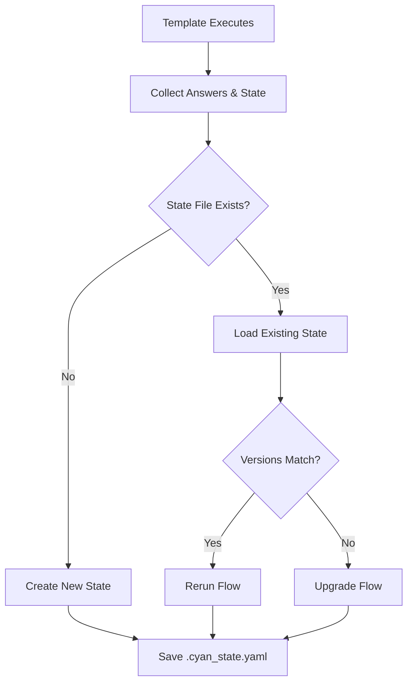
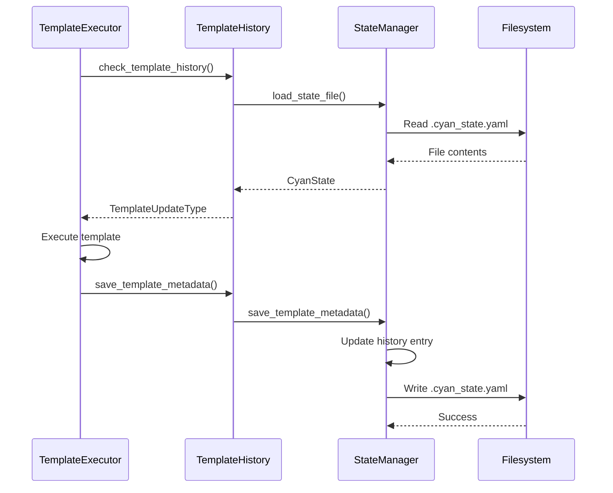

# State Persistence

**What**: Stores template execution state (version, answers, deterministic states) in `.cyan_state.yaml`.

**Why**: Enables template updates and reruns without re-asking questions.

**Key Files**:

- `cyancoordinator/src/state/services.rs` → `DefaultStateManager`
- `cyancoordinator/src/state/services.rs` → `save_template_metadata()`
- `cyancoordinator/src/state/services.rs` → `load_state_file()`

## Overview

After template execution, the system persists:

- Template version
- User answers
- Deterministic states
- Execution timestamp

This enables detecting whether a project is new, needs upgrade, or should rerun.

## Flow

### High-Level



### Detailed



| #   | Step             | What                       | Why                      | Key File            |
| --- | ---------------- | -------------------------- | ------------------------ | ------------------- |
| 1   | Check history    | Load existing state        | Determine execution type | `history.rs:69-115` |
| 2   | Load state       | Parse YAML file            | Access previous data     | `services.rs:25-35` |
| 3   | Execute template | Run with appropriate state | Generate output          | `executor.rs`       |
| 4   | Save metadata    | Append to history          | Record execution         | `services.rs:50-87` |
| 5   | Write file       | Persist to disk            | Enable future runs       | `services.rs:39-48` |

## State File Format

`.cyan_state.yaml` structure:

```yaml
templates:
  username/template-name:
    active: true
    history:
      - version: 1
        time: '2024-01-15T10:30:00Z'
        answers:
          project-name: 'my-project'
          features: ['auth', 'api']
        deterministic_states:
          timestamp: '2024-01-15T10:30:00Z'
```

**Key File**: `cyancoordinator/src/state/models.rs`

## Template Update Types

**Key File**: `cyancoordinator/src/template/history.rs:12-27`

| Type              | When            | Behavior                     |
| ----------------- | --------------- | ---------------------------- |
| `NewTemplate`     | No state file   | Fresh execution              |
| `UpgradeTemplate` | Version differs | 3-way merge with old version |
| `RerunTemplate`   | Same version    | Fresh Q&A, 3-way merge       |

## StateManager Interface

```rust
trait StateManager {
    fn load_state_file(&self, path: &Path) -> Result<CyanState>;
    fn save_state_file(&self, state: &CyanState, path: &Path) -> Result<()>;
    fn save_template_metadata(...) -> Result<()>;
}
```

**Key File**: `cyancoordinator/src/state/traits.rs`

## Edge Cases

| Case               | Behavior                      |
| ------------------ | ----------------------------- |
| File doesn't exist | Return default empty state    |
| Invalid YAML       | Return error, abort execution |
| Multiple templates | Each tracked separately       |

## Related

- [Answer Tracking](../concepts/03-answer-tracking.md) - Answer storage
- [Deterministic States](../concepts/04-deterministic-states.md) - State storage
- [Stateful Prompting](./06-stateful-prompting.md) - Q&A with state
