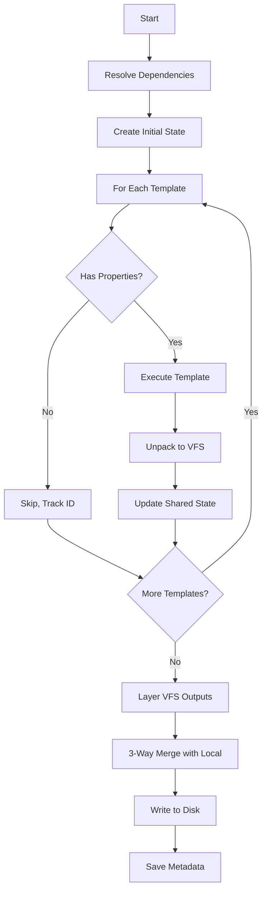
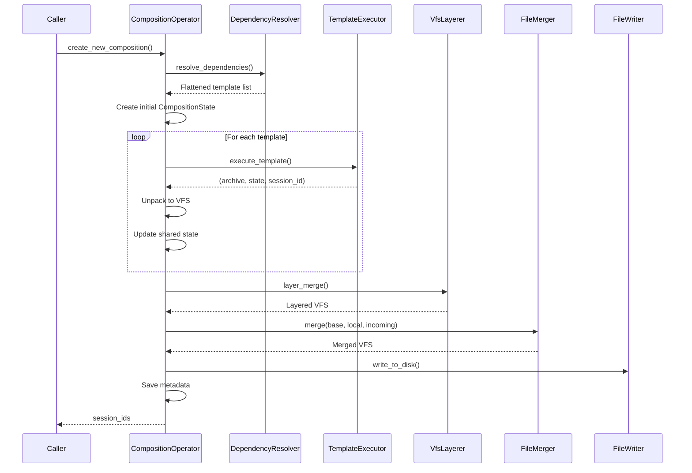

# Template Composition

**What**: Orchestrates execution of multiple templates with shared state and merges outputs.

**Why**: Enables complex, layered templates where higher-level templates build upon lower-level ones.

**Key Files**:

- `cyancoordinator/src/operations/composition/operator.rs` → `CompositionOperator`
- `cyancoordinator/src/operations/composition/operator.rs` → `execute_composition()`

## Overview

Template composition allows templates to depend on other templates. The composition operator:

1. Resolves dependencies in post-order
2. Executes each template with shared state
3. Layers outputs using VFS layering
4. Performs 3-way merge with local files
5. Writes result to disk

## Flow

### High-Level



### Detailed



| #   | Step                 | What                         | Why                     | Key File              |
| --- | -------------------- | ---------------------------- | ----------------------- | --------------------- |
| 1   | Resolve dependencies | Post-order traversal         | Deterministic execution | `operator.rs:111`     |
| 2   | Create initial state | Empty CompositionState       | Start fresh             | `operator.rs:114`     |
| 3   | Check properties     | Test for execution artifacts | Skip group templates    | `operator.rs:44-57`   |
| 4   | Execute template     | Run in container             | Generate files          | `operator.rs:70-76`   |
| 5   | Unpack VFS           | Convert archive to VFS       | Access files            | `operator.rs:79`      |
| 6   | Update state         | Merge answers and states     | Share with dependents   | `operator.rs:83`      |
| 7   | Layer outputs        | Overlay merge                | Combine all outputs     | `operator.rs:95`      |
| 8   | 3-way merge          | Merge with local files       | Preserve user changes   | `operator.rs:127-130` |
| 9   | Write to disk        | Persist files                | Create project          | `operator.rs:133-135` |
| 10  | Save metadata        | Write .cyan_state.yaml       | Enable future updates   | `operator.rs:149-151` |

## Composition State

```rust
pub struct CompositionState {
    pub shared_answers: HashMap<String, Answer>,
    pub shared_deterministic_states: HashMap<String, String>,
    pub execution_order: Vec<String>,
}
```

**Key File**: `cyancoordinator/src/operations/composition/state.rs:7-11`

## Execution Scenarios

| Scenario    | Base State       | Answer Source          |
| ----------- | ---------------- | ---------------------- |
| **New**     | Empty            | Fresh Q&A              |
| **Upgrade** | Previous version | Reuse + prompt for new |
| **Rerun**   | Previous version | Fresh Q&A              |

**Key File**: `cyancoordinator/src/operations/composition/operator.rs`

## Create vs Upgrade vs Rerun

| Method                   | Base VFS         | Incoming VFS  | Answers |
| ------------------------ | ---------------- | ------------- | ------- |
| `create_new_composition` | Empty            | All templates | Fresh   |
| `upgrade_composition`    | Previous version | New version   | Reused  |
| `rerun_composition`      | Previous version | Same version  | Fresh   |

**Key File**: `cyancoordinator/src/operations/composition/operator.rs:102-319`

## Edge Cases

| Case                   | Behavior               |
| ---------------------- | ---------------------- |
| All group templates    | Returns empty VFS      |
| Mixed executable/group | Skips group, tracks ID |
| Empty composition      | Creates empty project  |

## Related

- [Template Composition Concept](../concepts/06-template-composition.md) - Concept overview
- [Properties Field](../concepts/08-properties-field.md) - How properties determines execution
- [Dependency Resolution](./01-dependency-resolution.md) - Dependency ordering
- [VFS Layering](./03-vfs-layering.md) - Output merging
- [3-Way Merge](./02-three-way-merge.md) - User change preservation
