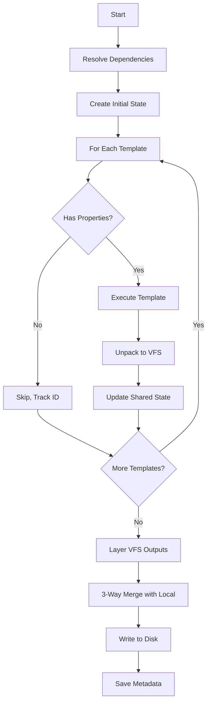
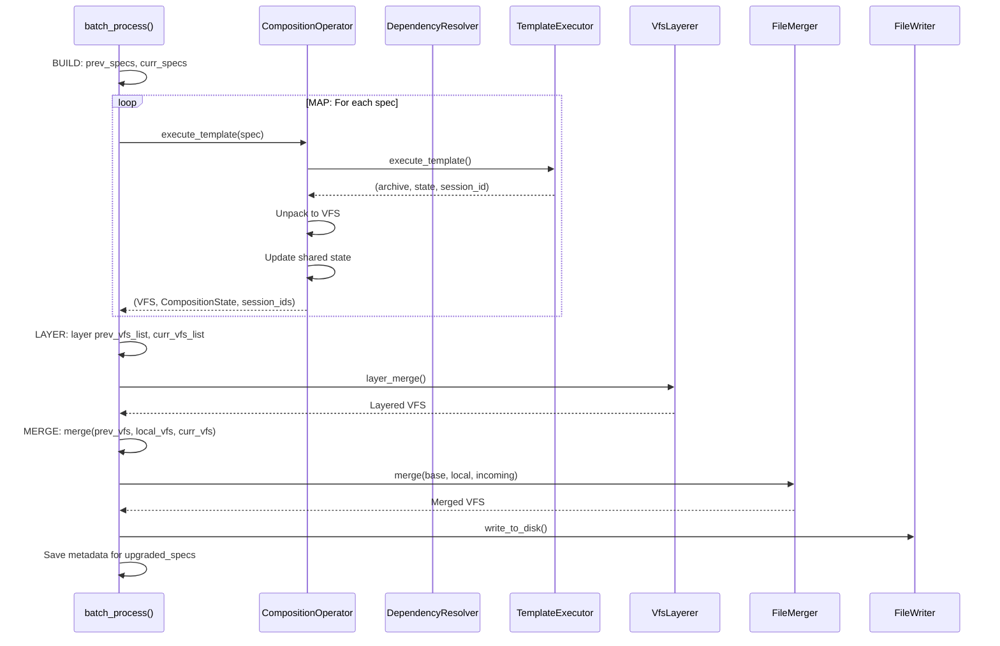

# Template Composition

**What**: Orchestrates execution of multiple templates with shared state and merges outputs.

**Why**: Enables complex, layered templates where higher-level templates build upon lower-level ones.

**Key Files**:

- `cyancoordinator/src/operations/composition/operator.rs` → `CompositionOperator`
- `cyanprint/src/run.rs` → `batch_process()`
- `cyanprint/src/update/spec.rs` → `TemplateSpecManager`

## Overview

Template composition allows templates to depend on other templates. The composition operator:

1. Resolves dependencies in post-order
2. Executes each template with shared state
3. Layers outputs using VFS layering
4. Performs 3-way merge with local files
5. Writes result to disk

## CompositionOperator API (v4+)

The operator now exposes composable primitives instead of scenario-specific methods:

| Method                                        | Input            | Output                               | Purpose                   |
| --------------------------------------------- | ---------------- | ------------------------------------ | ------------------------- |
| `execute_template(template, answers, states)` | Template + state | (VFS, CompositionState, session_ids) | Execute one template spec |
| `layer_merge([VFS...])`                       | VFS list         | VFS                                  | Merge with LWW semantics  |
| `merge(base, local, incoming)`                | 3 VFS            | VFS                                  | 3-way merge               |
| `load_local_files(dir)`                       | Path             | VFS                                  | Load target directory     |
| `write_to_disk(dir, vfs)`                     | Path + VFS       | ()                                   | Persist files             |

## Caller Responsibility

The caller (`cyanprint/src/run.rs::batch_process()`) now constructs scenarios:

1. Build prev_specs and curr_specs
2. MAP: Execute each spec → VFS
3. LAYER: Merge VFS lists
4. MERGE+WRITE: 3-way merge with local, write to disk

## Flow

### High-Level



### Detailed



| #   | Step             | What                         | Why                    | Key File                |
| --- | ---------------- | ---------------------------- | ---------------------- | ----------------------- |
| 1   | BUILD            | Construct prev/curr specs    | Prepare for processing | `run.rs`                |
| 2   | MAP              | Execute each template spec   | Generate VFS outputs   | `run.rs::batch_process` |
| 3   | Check properties | Test for execution artifacts | Skip group templates   | `operator.rs:44-57`     |
| 4   | Execute template | Run in container             | Generate files         | `operator.rs:70-76`     |
| 5   | Unpack VFS       | Convert archive to VFS       | Access files           | `operator.rs:79`        |
| 6   | Update state     | Merge answers and states     | Share with dependents  | `operator.rs:83`        |
| 7   | LAYER            | Overlay merge                | Combine all outputs    | `run.rs::batch_process` |
| 8   | MERGE            | 3-way merge with local files | Preserve user changes  | `run.rs::batch_process` |
| 9   | WRITE            | Persist files                | Create project         | `run.rs::batch_process` |
| 10  | Save metadata    | Write .cyan_state.yaml       | Enable future updates  | `run.rs::batch_process` |

## Composition State

```rust
pub struct CompositionState {
    pub shared_answers: HashMap<String, Answer>,
    pub shared_deterministic_states: HashMap<String, String>,
    pub execution_order: Vec<String>,
}
```

**Key File**: `cyancoordinator/src/operations/composition/state.rs:7-11`

## TemplateSpecManager API (v4+)

```rust
pub struct TemplateSpecManager {
    registry: Rc<CyanRegistryClient>,
}

impl TemplateSpecManager {
    pub fn new(registry: Rc<CyanRegistryClient>) -> Self;
    pub fn get(&self, state: &CyanState) -> Vec<TemplateSpec>;
    pub fn update(&self, specs: Vec<TemplateSpec>, interactive: bool)
        -> Result<Vec<TemplateSpec>, Box<dyn Error + Send>>;
    pub fn reset(&self, specs: Vec<TemplateSpec>) -> Vec<TemplateSpec>;
}

pub fn sort_specs(specs: &mut [TemplateSpec]);
```

**Key File**: `cyanprint/src/update/spec.rs`

## Execution Scenarios

| Scenario    | prev_specs           | curr_specs                          | upgraded_specs    |
| ----------- | -------------------- | ----------------------------------- | ----------------- |
| **New**     | `[]`                 | `[TemplateSpec::new_template(...)]` | `[new_spec]`      |
| **Add**     | `manager.get(state)` | `prev + [new_spec]`                 | `[new_spec]`      |
| **Upgrade** | `manager.get(state)` | `manager.update(prev)`              | `[changed_specs]` |
| **Rerun**   | `manager.get(state)` | `manager.reset(prev)`               | `[target_spec]`   |

**Key File**: `cyanprint/src/run.rs::cyan_run()`

## Create vs Upgrade vs Rerun

| Method             | Base VFS     | Incoming VFS | Answers |
| ------------------ | ------------ | ------------ | ------- |
| `execute_template` | N/A          | Template VFS | Spec    |
| `layer_merge`      | N/A          | N/A          | N/A     |
| `merge`            | prev + local | curr         | N/A     |

**Key File**: `cyanprint/src/run.rs::batch_process()`

## Edge Cases

| Case                   | Behavior               |
| ---------------------- | ---------------------- |
| All group templates    | Returns empty VFS      |
| Mixed executable/group | Skips group, tracks ID |
| Empty composition      | Creates empty project  |

## Related

- [Template Composition Concept](../concepts/06-template-composition.md) - Concept overview
- [Properties Field](../concepts/08-properties-field.md) - How properties determines execution
- [Dependency Resolution](./01-dependency-resolution.md) - Dependency ordering
- [VFS Layering](./03-vfs-layering.md) - Output merging
- [3-Way Merge](./02-three-way-merge.md) - User change preservation
