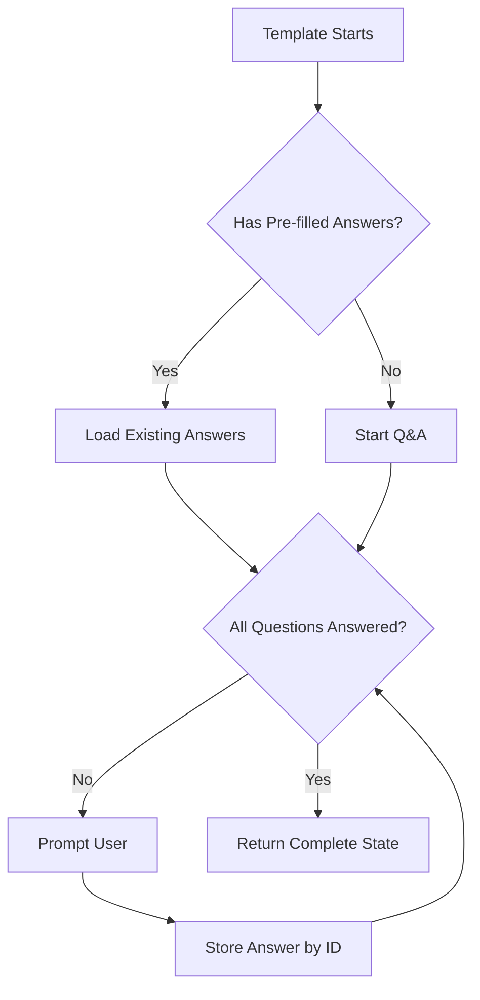
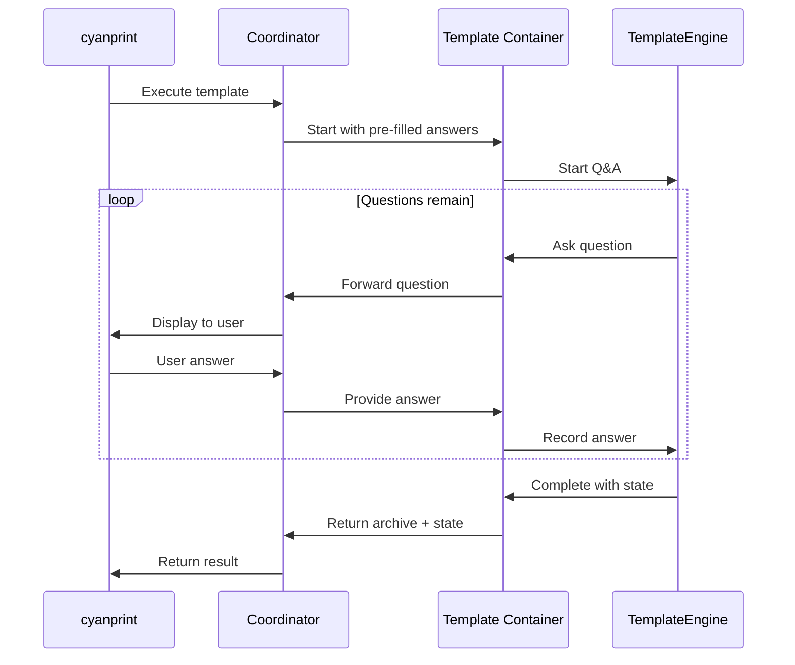
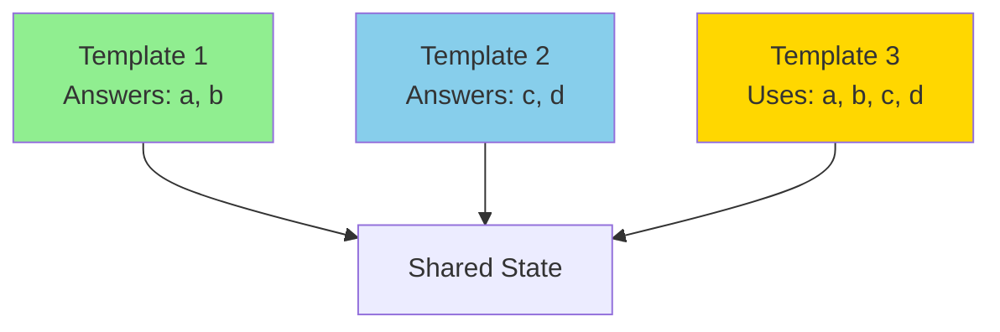

# Stateful Prompting

**What**: Tracks user answers by question ID and reuses them across template executions and compositions.

**Why**: Creates seamless Q&A experience where questions are asked once and answers propagate.

**Key Files**:

- `cyanprompt/src/domain/services/template/engine.rs` → `TemplateEngine`
- `cyancoordinator/src/template/executor.rs` → `execute_template()`
- `cyancoordinator/src/operations/composition/state.rs` → `CompositionState`

## Overview

When templates execute, they prompt users for input. Stateful prompting:

1. Tracks answers by unique question ID
2. Shares answers across templates in a composition
3. Reuses answers on re-runs and updates
4. Validates type consistency across templates

## Flow

### High-Level



### Detailed



| #   | Step            | What                     | Why                     | Key File      |
| --- | --------------- | ------------------------ | ----------------------- | ------------- |
| 1   | Start execution | Begin template run       | Initialize Q&A flow     | `executor.rs` |
| 2   | Load pre-filled | Provide existing answers | Skip answered questions | `executor.rs` |
| 3   | Ask question    | Present to user          | Collect input           | `engine.rs`   |
| 4   | Record answer   | Store by question ID     | Enable reuse            | `engine.rs`   |
| 5   | Complete state  | Return all answers       | Persist for future      | `states.rs`   |

## Answer Types

**Key File**: `cyanprompt/src/domain/models/answer.rs:5-10`

| Type          | Description          |
| ------------- | -------------------- |
| `String`      | Single text value    |
| `StringArray` | Multiple text values |
| `Bool`        | Boolean value        |

## Template States

**Key File**: `cyanprompt/src/domain/services/template/states.rs:6-10`

```rust
pub enum TemplateState {
    QnA,                      // Still prompting
    Complete(Cyan, HashMap<String, Answer>),  // Done with answers
    Err(String),              // Error occurred
}
```

## Shared State in Composition



**Key File**: `cyancoordinator/src/operations/composition/operator.rs:34-87`

## Type Conflict Detection

When merging answers, types must match:

```rust
if discriminant(existing) != discriminant(value) {
    panic!("Type conflict for key '{key}'");
}
```

**Key File**: `cyancoordinator/src/operations/composition/state.rs:35-39`

## Pre-filled Answers

On re-run or update, previous answers are provided:

```rust
execute_template(
    template,
    session_id,
    Some(&shared_answers),           // Pre-fill
    Some(&shared_deterministic_states),
)
```

**Key File**: `cyancoordinator/src/template/executor.rs`

## Edge Cases

| Case               | Behavior                  |
| ------------------ | ------------------------- |
| Empty pre-filled   | Fresh Q&A session         |
| Partial pre-filled | Answer only new questions |
| Type conflict      | Abort with panic          |

## Related

- [Answer Tracking](../concepts/03-answer-tracking.md) - Answer storage
- [Stateful Prompting Concept](../concepts/05-stateful-prompting.md) - Concept overview
- [Template Composition](./05-template-composition.md) - Shared state flow
- [State Persistence](./04-state-persistence.md) - Persisting answers
