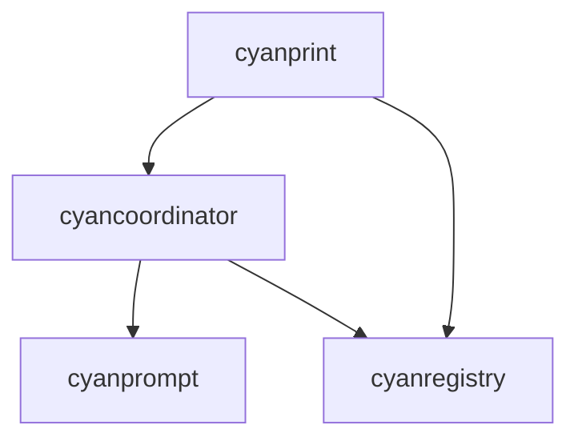

# Modules Overview

Code organization for Iridium crates.

## Map

| Module          | Role                          |
| --------------- | ----------------------------- |
| cyanprint       | CLI entry point, commands     |
| cyancoordinator | Core engine, composition, VFS |
| cyanprompt      | Prompting domain models       |
| cyanregistry    | Registry HTTP client          |

## All Modules

| Module                                     | What             | Why                    | Key Files                    |
| ------------------------------------------ | ---------------- | ---------------------- | ---------------------------- |
| [cyanprint](./01-cyanprint.md)             | CLI binary       | User interface         | `cyanprint/src/main.rs`      |
| [cyancoordinator](./02-cyancoordinator.md) | Core engine      | Template orchestration | `cyancoordinator/src/lib.rs` |
| [cyanprompt](./03-cyanprompt.md)           | Prompting engine | Q&A domain logic       | `cyanprompt/src/lib.rs`      |
| [cyanregistry](./04-cyanregistry.md)       | Registry client  | Registry API           | `cyanregistry/src/lib.rs`    |

## Groups

### Group 1: Application Layer

- **[cyanprint](./01-cyanprint.md)** - CLI application

### Group 2: Engine Layer

- **[cyancoordinator](./02-cyancoordinator.md)** - Core orchestration
- **[cyanprompt](./03-cyanprompt.md)** - Prompting domain

### Group 3: Infrastructure Layer

- **[cyanregistry](./04-cyanregistry.md)** - Registry communication
