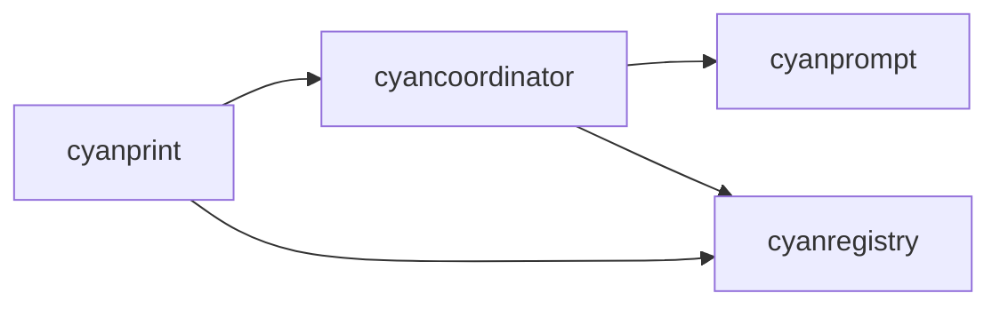

# cyanprint

**What**: CLI binary for CyanPrint template operations.

**Why**: Provides user-facing commands for template creation, updates, and publishing.

**Key Files**:

- `cyanprint/src/main.rs` - Entry point
- `cyanprint/src/commands.rs` - CLI definitions
- `cyanprint/src/run.rs` - Template execution
- `cyanprint/src/update.rs` - Template updates
- `cyanprint/src/coord.rs` - Coordinator startup

## Responsibilities

- Parse CLI arguments and route to commands
- Communicate with registry for template operations
- Communicate with coordinator for template execution
- Handle session cleanup
- Start coordinator daemon

## Structure

```text
cyanprint/
├── src/
│   ├── main.rs          # Entry point, command routing
│   ├── commands.rs      # Clap CLI definitions
│   ├── run.rs           # Template execution logic
│   ├── update.rs        # Template update logic
│   ├── coord.rs         # Coordinator daemon startup
│   ├── util.rs          # Utility functions
│   └── errors.rs        # Error types
└── Cargo.toml
```

| File          | Purpose                                            |
| ------------- | -------------------------------------------------- |
| `main.rs`     | Main function, HTTP client setup, command dispatch |
| `commands.rs` | CLI argument definitions using clap                |
| `run.rs`      | Auto-detect template type and execute              |
| `update.rs`   | Update templates to latest versions                |
| `coord.rs`    | Start coordinator in Docker container              |
| `util.rs`     | Parse template references                          |
| `errors.rs`   | Error types for CLI operations                     |

## Dependencies



| Dependency      | Why                                             |
| --------------- | ----------------------------------------------- |
| cyancoordinator | Template execution, composition, VFS operations |
| cyanregistry    | Template and artifact operations                |

## Key Interfaces

### Command Parsing

Uses `clap::Parser` for CLI argument parsing.

**Key File**: `cyanprint/src/commands.rs`

### Template Execution

```rust
pub fn cyan_run(
    session_id_generator: Box<dyn SessionIdGenerator>,
    path: Option<String>,
    template: TemplateVersionRes,
    coord_client: CyanCoordinatorClient,
    username: String,
    registry_client: Rc<CyanRegistryClient>,
    debug: bool,
) -> Result<Vec<String>, Box<dyn Error + Send>>
```

**Key File**: `cyanprint/src/run.rs:32-40`

### Template Update

```rust
pub fn cyan_update(
    session_id_generator: Box<dyn SessionIdGenerator>,
    path: String,
    coord_client: CyanCoordinatorClient,
    registry_client: Rc<CyanRegistryClient>,
    debug: bool,
    interactive: bool,
) -> Result<Vec<String>, Box<dyn Error + Send>>
```

**Key File**: `cyanprint/src/update.rs:24-31`

## Commands

| Command  | Description                                        |
| -------- | -------------------------------------------------- |
| `push`   | Publish templates, plugins, processors to registry |
| `create` | Create project from template                       |
| `update` | Update templates to latest versions                |
| `daemon` | Start coordinator service                          |

## Related

- [CLI Commands](../surfaces/cli/) - Detailed command reference
- [cyancoordinator](./02-cyancoordinator.md) - Core engine used by CLI
- [cyanregistry](./04-cyanregistry.md) - Registry client used by CLI
