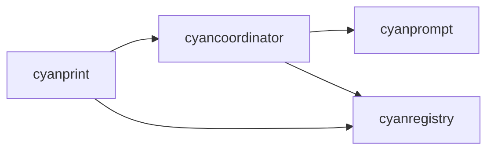

# cyanprint

**What**: CLI binary for CyanPrint template operations.

**Why**: Provides user-facing commands for template creation, updates, and publishing.

**Key Files**:

- `cyanprint/src/main.rs` - Entry point
- `cyanprint/src/commands.rs` - CLI definitions
- `cyanprint/src/run.rs` - Template execution + batch_process()
- `cyanprint/src/update.rs` - Template updates
- `cyanprint/src/update/spec.rs` - TemplateSpec + TemplateSpecManager
- `cyanprint/src/coord.rs` - Coordinator startup

## Responsibilities

- Parse CLI arguments and route to commands
- Communicate with registry for template operations
- Communicate with coordinator for template execution
- Handle session cleanup
- Start coordinator daemon

## Structure

```text
cyanprint/
├── src/
│   ├── main.rs          # Entry point, command routing
│   ├── commands.rs      # Clap CLI definitions
│   ├── run.rs           # Template execution + batch_process()
│   ├── update/
│   │   ├── mod.rs       # Update module exports
│   │   ├── orchestrator.rs  # Update command orchestration
│   │   ├── spec.rs      # TemplateSpec + TemplateSpecManager
│   │   ├── version_manager.rs
│   │   └── utils.rs
│   ├── coord.rs         # Coordinator daemon startup
│   ├── util.rs          # Utility functions
│   └── errors.rs        # Error types
└── Cargo.toml
```

| File                     | Purpose                                                 |
| ------------------------ | ------------------------------------------------------- |
| `main.rs`                | Main function, HTTP client setup, command dispatch      |
| `commands.rs`            | CLI argument definitions using clap                     |
| `run.rs`                 | Auto-detect template type and execute + batch_process() |
| `update/`                | Template update module                                  |
| `update/spec.rs`         | TemplateSpec data structure + TemplateSpecManager       |
| `update/orchestrator.rs` | Update command orchestration                            |
| `coord.rs`               | Start coordinator in Docker container                   |
| `util.rs`                | Parse template references                               |
| `errors.rs`              | Error types for CLI operations                          |

## Dependencies



| Dependency      | Why                                             |
| --------------- | ----------------------------------------------- |
| cyancoordinator | Template execution, composition, VFS operations |
| cyanregistry    | Template and artifact operations                |

## Key Interfaces

### Command Parsing

Uses `clap::Parser` for CLI argument parsing.

**Key File**: `cyanprint/src/commands.rs`

### Batch Processing

```rust
// run.rs
pub fn batch_process(
    prev_specs: &[TemplateSpec],
    curr_specs: &[TemplateSpec],
    upgraded_specs: &[&TemplateSpec],
    target_dir: &Path,
    registry: &CyanRegistryClient,
    operator: &CompositionOperator,
) -> Result<Vec<String>, Box<dyn Error + Send>>
```

4-phase model: BUILD → MAP → LAYER → MERGE+WRITE

**Key File**: `cyanprint/src/run.rs`

### TemplateSpecManager

```rust
// update/spec.rs
pub struct TemplateSpecManager {
    registry: Rc<CyanRegistryClient>,
}

impl TemplateSpecManager {
    pub fn new(registry: Rc<CyanRegistryClient>) -> Self;
    pub fn get(&self, state: &CyanState) -> Vec<TemplateSpec>;
    pub fn update(&self, specs: Vec<TemplateSpec>, interactive: bool)
        -> Result<Vec<TemplateSpec>, Box<dyn Error + Send>>;
    pub fn reset(&self, specs: Vec<TemplateSpec>) -> Vec<TemplateSpec>;
}

pub fn sort_specs(specs: &mut [TemplateSpec>);
```

**Key File**: `cyanprint/src/update/spec.rs`

### Template Execution

```rust
pub fn cyan_run(
    session_id_generator: Box<dyn SessionIdGenerator>,
    path: Option<String>,
    template: TemplateVersionRes,
    coord_client: CyanCoordinatorClient,
    username: String,
    registry_client: Rc<CyanRegistryClient>,
    debug: bool,
) -> Result<Vec<String>, Box<dyn Error + Send>>
```

**Key File**: `cyanprint/src/run.rs`

### Template Update

```rust
pub fn cyan_update(
    session_id_generator: Box<dyn SessionIdGenerator>,
    path: String,
    coord_client: CyanCoordinatorClient,
    registry_client: Rc<CyanRegistryClient>,
    debug: bool,
    interactive: bool,
) -> Result<Vec<String>, Box<dyn Error + Send>>
```

**Key File**: `cyanprint/src/update.rs`

## Commands

| Command  | Description                                        |
| -------- | -------------------------------------------------- |
| `push`   | Publish templates, plugins, processors to registry |
| `create` | Create project from template                       |
| `update` | Update templates to latest versions                |
| `daemon` | Start coordinator service                          |
| `test`   | Run template/processor/plugin/resolver tests       |

### Test Command — Container Lifecycle

All test commands (`template`, `plugin`, `processor`, `resolver`) use **run-scoped container ownership** via a shared `RunGuard` (RAII Drop guard in `container.rs`):

1. A **run UUID** (`uuid::Uuid::new_v4()`) is generated at the start of each test entry point (`run_template_tests()`, `run_plugin_tests()`, `run_processor_tests()`, `run_resolver_tests()`)
2. All containers created during the run are labeled with `cyanprint.test.run=<uuid>`
3. On scope exit (normal return, error, or panic), the `RunGuard::drop()` removes all containers matching its run UUID

This approach prevents nested test runs from killing parent containers — each run owns only its own containers.

**Key File**: `cyanprint/src/test_cmd/container.rs` (`RunGuard` struct)

### Test Command — Template Dependency Composition

`test template` composes the template's declared dependencies by **default**, so the snapshot/validation runs against the **final merged state** (root template layered with all dependency templates), matching what `create` would actually produce.

- **Default (dependencies included)**: when `cyan.yaml` declares template dependencies, execution is routed through the `CompositionOperator` (the same path used by `create` and `try group`). It resolves the dependency tree, executes the root plus each dependency with the test case's answers/deterministic state, and layers the outputs before comparison.
- **`--skip-deps`**: tests the root template in isolation using the pre-warmed single-container path. Use this for faster, focused tests of a single template's output. Templates with no dependencies always use the isolated path regardless of the flag.

**Key Files**: `cyanprint/src/test_cmd/template.rs` (`run_composition_tests`, `run_isolated_tests`), `cyancoordinator/src/operations/composition/operator.rs` (`CompositionOperator`)

## Related

- [CLI Commands](../surfaces/cli/) - Detailed command reference
- [cyancoordinator](./02-cyancoordinator.md) - Core engine used by CLI
- [cyanregistry](./04-cyanregistry.md) - Registry client used by CLI
