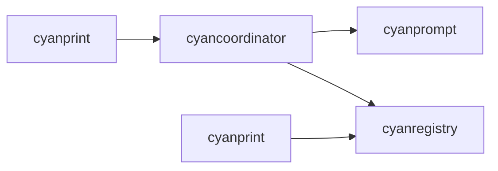

# cyancoordinator

**What**: Core template orchestration engine.

**Why**: Handles template execution, composition, dependency resolution, and file system operations.

**Key Files**:

- `cyancoordinator/src/lib.rs` - Module exports
- `cyancoordinator/src/client.rs` - Coordinator HTTP client
- `cyancoordinator/src/operations/composition/operator.rs` - Composition operator
- `cyancoordinator/src/fs/merger.rs` - 3-way merge
- `cyancoordinator/src/state/services.rs` - State persistence

## Responsibilities

- Template execution and orchestration
- Dependency resolution for template groups
- Virtual file system operations
- 3-way merging for updates
- State persistence and loading
- Session management

## Structure

```text
cyancoordinator/
├── src/
│   ├── lib.rs                # Module exports
│   ├── client.rs             # Coordinator HTTP client
│   ├── models/               # Request/response models
│   ├── errors.rs             # Error types
│   ├── fs/                   # Virtual file system
│   │   ├── mod.rs            # VFS module
│   │   ├── vfs.rs            # VFS struct
│   │   ├── traits.rs         # FileMerger, etc.
│   │   ├── loader.rs         # Load local files
│   │   ├── merger.rs         # 3-way git merge
│   │   ├── unpacker.rs       # Unpack archives
│   │   └── writer.rs         # Write to disk
│   ├── operations/           # Template operations
│   │   ├── mod.rs            # Operations module
│   │   ├── composition/      # Template composition
│   │   │   ├── mod.rs
│   │   │   ├── operator.rs   # Composition operator
│   │   │   ├── resolver.rs   # Dependency resolution
│   │   │   ├── layerer.rs    # VFS layering
│   │   │   └── state.rs      # Composition state
│   ├── session/              # Session management
│   │   ├── mod.rs
│   │   └── generator.rs      # Session ID generation
│   ├── state/                # State persistence
│   │   ├── mod.rs
│   │   ├── models.rs         # State YAML models
│   │   ├── services.rs       # State manager
│   │   └── traits.rs         # StateManager trait
│   └── template/             # Template execution
│       ├── mod.rs
│       ├── executor.rs       # Template executor
│       └── history.rs        # Template history
└── Cargo.toml
```

| File                                 | Purpose                                   |
| ------------------------------------ | ----------------------------------------- |
| `lib.rs`                             | Public API exports                        |
| `client.rs`                          | HTTP client for coordinator communication |
| `fs/vfs.rs`                          | In-memory file system                     |
| `fs/merger.rs`                       | Git-like 3-way merge                      |
| `operations/composition/operator.rs` | Multi-template orchestration              |
| `operations/composition/resolver.rs` | Dependency resolution                     |
| `state/services.rs`                  | `.cyan_state.yaml` persistence            |
| `template/executor.rs`               | Template execution in containers          |

## Dependencies



| Dependency   | Why                                       |
| ------------ | ----------------------------------------- |
| cyanprompt   | Domain models for answers, template state |
| cyanregistry | Template metadata and registry operations |

| Dependent | Why                       |
| --------- | ------------------------- |
| cyanprint | Template execution engine |

## Key Interfaces

### CyanCoordinatorClient

```rust
pub struct CyanCoordinatorClient {
    pub endpoint: String,
    pub client: Rc<reqwest::blocking::Client>,
}

impl CyanCoordinatorClient {
    pub fn new(endpoint: String) -> Self;
    pub fn clean(&self, session_id: String) -> Result<...>;
    pub fn bootstrap(&self, req: BootstrapRequest) -> Result<...>;
    pub fn warm_executor(&self) -> Result<...>;
    pub fn warm_template(&self, req: WarmTemplateRequest) -> Result<...>;
}
```

**Key File**: `cyancoordinator/src/client.rs`

### CompositionOperator

```rust
pub struct CompositionOperator {
    template_operator: TemplateOperator,
    dependency_resolver: Box<dyn DependencyResolver>,
    vfs_layerer: Box<dyn VfsLayerer>,
}

impl CompositionOperator {
    pub fn create_new_composition(...) -> Result<Vec<String>>;
    pub fn upgrade_composition(...) -> Result<Vec<String>>;
    pub fn rerun_composition(...) -> Result<Vec<String>>;
}
```

**Key File**: `cyancoordinator/src/operations/composition/operator.rs`

### Virtual File System

```rust
pub struct VirtualFileSystem {
    pub(crate) files: HashMap<PathBuf, Vec<u8>>,
}

impl VirtualFileSystem {
    pub fn new() -> Self;
    pub fn add_file(&mut self, path: PathBuf, content: Vec<u8>);
    pub fn get_file(&self, path: &Path) -> Option<&Vec<u8>>;
    pub fn get_paths(&self) -> Vec<PathBuf>;
}
```

**Key File**: `cyancoordinator/src/fs/vfs.rs`

## Related

- [cyanprint](./01-cyanprint.md) - Uses this module
- [cyanprompt](./03-cyanprompt.md) - Domain models
- [cyanregistry](./04-cyanregistry.md) - Registry client
- [Template Composition](../features/05-template-composition.md) - Composition feature
