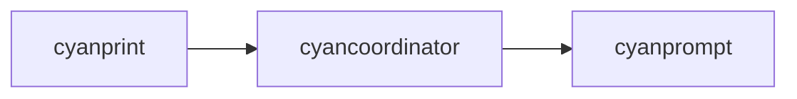

# cyanprompt

**What**: Domain models and services for template prompting.

**Why**: Provides the Q&A flow with answer tracking and validation.

**Key Files**:

- `cyanprompt/src/lib.rs` - Module exports
- `cyanprompt/src/domain/models/answer.rs` - Answer types
- `cyanprompt/src/domain/models/cyan.rs` - Cyan configuration models
- `cyanprompt/src/domain/services/template/engine.rs` - Template engine
- `cyanprompt/src/domain/services/template/states.rs` - Template states

## Responsibilities

- Define answer types (String, StringArray, Bool)
- Define template state machine (QnA, Complete, Err)
- Provide template engine interface
- Define Cyan configuration models

## Structure

```text
cyanprompt/
├── src/
│   ├── lib.rs                # Module exports
│   └── domain/
│       ├── models/
│       │   ├── answer.rs     # Answer enum
│       │   └── cyan.rs       # Cyan configuration
│       └── services/
│           └── template/
│               ├── engine.rs # Template engine
│               └── states.rs # TemplateState enum
└── Cargo.toml
```

| File                                 | Purpose                     |
| ------------------------------------ | --------------------------- |
| `lib.rs`                             | Public API exports          |
| `domain/models/answer.rs`            | Answer type definitions     |
| `domain/models/cyan.rs`              | Processor and plugin models |
| `domain/services/template/engine.rs` | Template engine             |
| `domain/services/template/states.rs` | Template state machine      |

## Dependencies



| Dependent       | Why                                        |
| --------------- | ------------------------------------------ |
| cyancoordinator | Uses answer and state types in composition |

## Key Interfaces

### Answer Type

```rust
#[derive(Clone, Serialize, Deserialize)]
#[serde(tag = "type", content = "value")]
pub enum Answer {
    String(String),
    StringArray(Vec<String>),
    Bool(bool),
}
```

**Key File**: `cyanprompt/src/domain/models/answer.rs:5-10`

### Template State

```rust
#[derive(Clone)]
pub enum TemplateState {
    QnA(),
    Complete(Cyan, HashMap<String, Answer>),
    Err(String),
}

impl TemplateState {
    pub fn cont(&self) -> bool {
        match self {
            TemplateState::QnA() => true,
            TemplateState::Complete(_, _) => false,
            TemplateState::Err(_) => false,
        }
    }
}
```

**Key File**: `cyanprompt/src/domain/services/template/states.rs:6-20`

### Cyan Configuration

```rust
pub struct Cyan {
    pub processors: Vec<CyanProcessor>,
    pub plugins: Vec<CyanPlugin>,
}

pub struct CyanProcessor {
    pub name: String,
    pub config: Value,
    pub files: Vec<CyanGlob>,
}

pub struct CyanPlugin {
    pub name: String,
    pub config: Value,
}
```

**Key File**: `cyanprompt/src/domain/models/cyan.rs:17-34`

### TemplateEngine

```rust
pub struct TemplateEngine {
    pub client: Rc<dyn CyanRepo>,
}

impl TemplateEngine {
    pub fn new(client: Rc<dyn CyanRepo>) -> TemplateEngine;
    pub fn start_with(
        &self,
        initial_answers: Option<HashMap<String, Answer>>,
        initial_states: Option<HashMap<String, String>>,
    ) -> TemplateState;
}
```

**Key File**: `cyanprompt/src/domain/services/template/engine.rs`

## Related

- [Stateful Prompting](../features/06-stateful-prompting.md) - Q&A feature
- [Answer Tracking](../concepts/03-answer-tracking.md) - Answer concept
- [cyancoordinator](./02-cyancoordinator.md) - Uses this module
