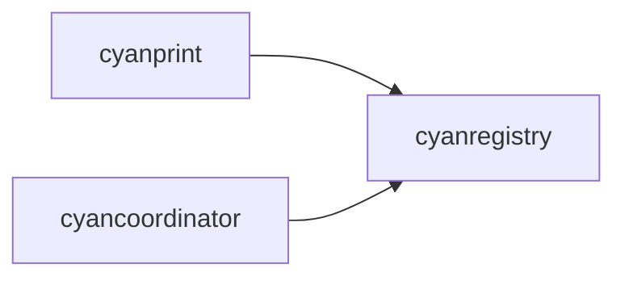

# cyanregistry

**What**: HTTP client for registry operations.

**Why**: Communicates with the template registry to fetch, publish, and query templates.

**Key Files**:

- `cyanregistry/src/lib.rs` - Module exports
- `cyanregistry/src/http/client.rs` - HTTP client
- `cyanregistry/src/http/models/` - Request/response models
- `cyanregistry/src/cli/` - CLI-specific models

## Responsibilities

- Fetch templates from registry
- Push templates, plugins, processors
- Query template metadata
- Map between domain and HTTP models

## Structure

```text
cyanregistry/
├── src/
│   ├── lib.rs                # Module exports
│   ├── domain/
│   │   └── config/           # Domain configuration models
│   ├── http/
│   │   ├── client.rs         # HTTP client
│   │   └── models/           # HTTP models
│   │       └── template_res.rs  # Template responses
│   └── cli/
│       ├── models/           # CLI models directory
│       │   ├── mod.rs
│       │   ├── plugin_config.rs
│       │   ├── processor_config.rs
│       │   └── template_config.rs
│       ├── mapper.rs         # Domain <-> HTTP mapping
│       └── mod.rs
└── Cargo.toml
```

| File             | Purpose                       |
| ---------------- | ----------------------------- |
| `lib.rs`         | Public API exports            |
| `http/client.rs` | Registry HTTP client          |
| `http/models/`   | Request/response types        |
| `cli/models/`    | CLI-specific models directory |
| `cli/mapper.rs`  | Model conversions             |

## Dependencies



| Dependent       | Why                              |
| --------------- | -------------------------------- |
| cyanprint       | Template and artifact operations |
| cyancoordinator | Dependency resolution            |

## Key Interfaces

### CyanRegistryClient

```rust
pub struct CyanRegistryClient {
    pub endpoint: String,
    pub version: String,
    pub client: Rc<reqwest::blocking::Client>,
}

impl CyanRegistryClient {
    pub fn get_template(
        &self,
        username: String,
        template_name: String,
        version: Option<i64>,
    ) -> Result<TemplateVersionRes>;

    pub fn get_template_version_by_id(
        &self,
        id: String,
    ) -> Result<TemplateVersionRes>;

    pub fn push_template(...) -> Result<PushRes>;
    pub fn push_processor(...) -> Result<PushRes>;
    pub fn push_plugin(...) -> Result<PushRes>;
    pub fn push_template_without_properties(...) -> Result<PushRes>;
}
```

**Key File**: `cyanregistry/src/http/client.rs`

### TemplateVersionRes

Template version response from registry:

```rust
pub struct TemplateVersionRes {
    pub principal: TemplatePrincipal,
    pub template: TemplateRef,
    pub templates: Vec<TemplateRef>,  // Dependencies
    pub properties: Option<TemplateProperties>,
}
```

**Key File**: `cyanregistry/src/http/models/template_res.rs`

## Registry Endpoints

| Endpoint          | Method | Purpose                        |
| ----------------- | ------ | ------------------------------ |
| `/template`       | GET    | Fetch template by name/version |
| `/template/{id}`  | GET    | Fetch template by ID           |
| `/template/push`  | POST   | Push new template              |
| `/processor/push` | POST   | Push processor                 |
| `/plugin/push`    | POST   | Push plugin                    |

## Related

- [cyanprint](./01-cyanprint.md) - Uses this module
- [cyancoordinator](./02-cyancoordinator.md) - Uses this module for dependencies
- [Dependency Resolution](../features/01-dependency-resolution.md) - Fetches dependencies
