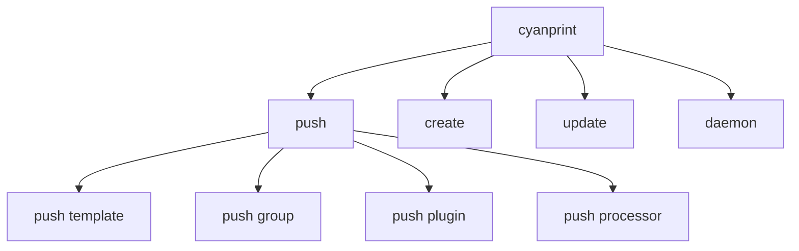

# CLI Commands Overview

User-facing commands for the CyanPrint CLI.

## Map

| Command  | Description                            |
| -------- | -------------------------------------- |
| `push`   | Publish templates, plugins, processors |
| `create` | Create project from template           |
| `update` | Update templates to latest versions    |
| `daemon` | Start coordinator service              |

## All Commands

| Command                  | Description                   | Key File                        |
| ------------------------ | ----------------------------- | ------------------------------- |
| [push](./01-push.md)     | Publish artifacts to registry | `cyanprint/src/main.rs:35-129`  |
| [create](./02-create.md) | Create from template          | `cyanprint/src/main.rs:131-191` |
| [update](./03-update.md) | Update templates              | `cyanprint/src/main.rs:192-227` |
| [daemon](./04-daemon.md) | Start coordinator             | `cyanprint/src/main.rs:228-255` |

## Global Options

| Option       | Short | Default                                               | Description         |
| ------------ | ----- | ----------------------------------------------------- | ------------------- |
| `--registry` | `-r`  | `https://api.zinc.sulfone.raichu.cluster.atomi.cloud` | Registry endpoint   |
| `--debug`    | `-d`  | `false`                                               | Enable debug output |

**Environment Variables**:

- `CYANPRINT_REGISTRY` - Override default registry endpoint
- `CYANPRINT_COORDINATOR` - Override default coordinator endpoint
- `CYAN_TOKEN` - API token for publishing

**Key File**: `cyanprint/src/commands.rs:3-25`

## Command Aliases

| Full Command | Short Alias |
| ------------ | ----------- |
| `push`       | `p`         |
| `create`     | `c`         |
| `update`     | `u`         |
| `daemon`     | `d`         |

**Key File**: `cyanprint/src/commands.rs:27-97`
