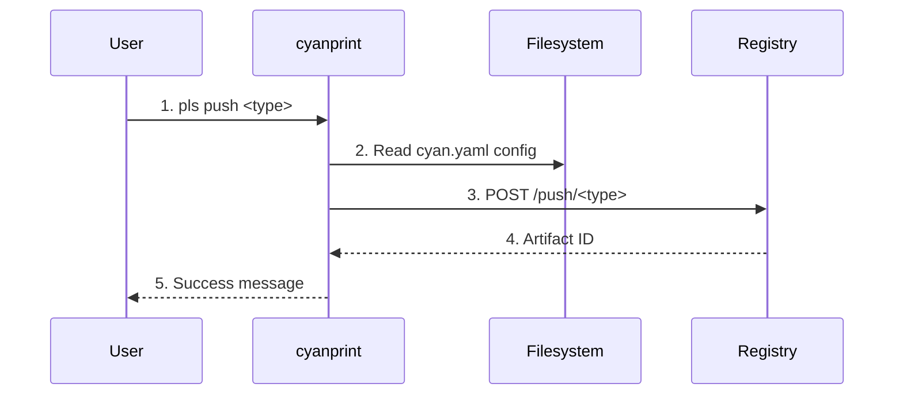

# push Command

**Key File**: `cyanprint/src/main.rs:35-129`

## Usage

```bash
pls push [OPTIONS] --token <API_TOKEN> <COMMAND> [SUBCOMMAND_OPTIONS] [ARGS]
```

> **Important**: Push options (`--config`, `--message`, `--token`, `--platform`, `--builder`, `--no-cache`, `--dry-run`) must come BEFORE the subcommand. Subcommand-specific options (like `--build`) come after the subcommand name.

## Description

Publishes CyanPrint artifacts (templates, template groups, plugins, processors, resolvers) to the registry.

Supports two modes:

1. **Push existing images**: Provide image reference and tag arguments
2. **Build and push**: Use `--build <tag>` to build Docker images first, then push to registry

## Subcommands

| Subcommand  | Description                                 | `properties` Field | Supports --build |
| ----------- | ------------------------------------------- | ------------------ | ---------------- |
| `template`  | Push executable template with Docker images | `Some(...)`        | Yes              |
| `group`     | Push template group (no Docker artifacts)   | `None`             | No               |
| `plugin`    | Push plugin Docker image                    | N/A                | Yes              |
| `processor` | Push processor Docker image                 | N/A                | Yes              |
| `resolver`  | Push resolver Docker image                  | N/A                | Yes              |

> See [Properties Field](../../concepts/08-properties-field.md) for how the subcommand determines the `properties` field.

## Options

| Option       | Short | Default          | Description                                              |
| ------------ | ----- | ---------------- | -------------------------------------------------------- |
| `--config`   | `-c`  | `cyan.yaml`      | Configuration file path                                  |
| `--message`  | `-m`  | `No description` | Publish message/description                              |
| `--token`    | `-t`  | (optional)       | API token for authentication (or set CYAN_TOKEN env var) |
| `--platform` |       | (from config)    | Target platforms for build (comma-separated)             |
| `--builder`  |       | (default)        | Buildx builder to use for build                          |
| `--no-cache` |       | false            | Don't use cache during build                             |
| `--dry-run`  |       | false            | Show build commands without executing                    |

**Environment Variable**: `CYAN_TOKEN`

**Key File**: `cyanprint/src/commands.rs:100-118`

## Build-Mode Options

When using `--build <tag>`, the following options control the build process:

| Option       | Description                                                 |
| ------------ | ----------------------------------------------------------- |
| `--platform` | Override target platforms (e.g., `linux/amd64,linux/arm64`) |
| `--builder`  | Use a specific buildx builder                               |
| `--no-cache` | Disable Docker build cache                                  |
| `--dry-run`  | Print build commands without executing                      |

These options require a valid `build` section in `cyan.yaml`:

```yaml
build:
  registry: ghcr.io/atomicloud
  platforms:
    - linux/amd64
  images:
    template:
      image: my-template
      dockerfile: Dockerfile.template
      context: .
    blob:
      image: my-blob
      dockerfile: Dockerfile.blob
      context: ./blob
```

## Subcommand Details

### push template

Publish executable template with blob and template Docker images.

**With --build (build and push in one step):**

```bash
pls push --config cyan.yaml --token YOUR_TOKEN --message "Initial release" template --build v1.0.0
```

**With explicit images (push pre-built images):**

```bash
pls push --config cyan.yaml --token YOUR_TOKEN --message "Initial release" template \
  registry/user/blob:v1.0.0 v1.0.0 registry/user/template:v1.0.0 v1.0.0
```

**Arguments (when not using --build)**:

- `blob_image` - Blob storage container image reference
- `blob_tag` - Blob image tag
- `template_image` - Template container image reference
- `template_tag` - Template image tag

**Key File**: `cyanprint/src/main.rs:56-88`

Output:

```text
🔨 Building images for push with tag: v1.0.0
...
✅ Pushed template successfully
📦 Template ID: 12345
```

### push group

Publish template group (meta-template with no execution artifacts).

```bash
pls push --config cyan.yaml --token YOUR_TOKEN --message "Group template" group
```

> Note: `--build` is not supported for groups since they have no Docker images.

**Key File**: `cyanprint/src/main.rs:89-108`

Output:

```text
🔗 Pushing template group (no Docker artifacts)...
✅ Pushed template group successfully
📦 Template ID: 12346
```

### push plugin

Publish plugin Docker image.

**With --build:**

```bash
pls push --config cyan.yaml --token YOUR_TOKEN --message "Plugin release" plugin --build v1.0.0
```

**With explicit image:**

```bash
pls push --config cyan.yaml --token YOUR_TOKEN --message "Plugin release" plugin registry/user/plugin:v1.0.0 v1.0.0
```

**Key File**: `cyanprint/src/main.rs:110-129`

### push processor

Publish processor Docker image.

**With --build:**

```bash
pls push --config cyan.yaml --token YOUR_TOKEN --message "Processor release" processor --build v1.0.0
```

**With explicit image:**

```bash
pls push --config cyan.yaml --token YOUR_TOKEN --message "Processor release" processor registry/user/processor:v1.0.0 v1.0.0
```

**Key File**: `cyanprint/src/main.rs:36-54`

### push resolver

Publish resolver Docker image.

**With --build:**

```bash
pls push --config cyan.yaml --token YOUR_TOKEN --message "Resolver release" resolver --build v1.0.0
```

**With explicit image:**

```bash
pls push --config cyan.yaml --token YOUR_TOKEN --message "Resolver release" resolver registry/user/resolver:v1.0.0 v1.0.0
```

**Arguments (when not using --build)**:

- `image` - Resolver container image reference
- `tag` - Resolver image tag

**Key File**: `cyanregistry/src/http/client.rs:207-220`

Resolvers are used during template updates to resolve merge conflicts. See [Resolver](../../concepts/09-resolver.md) for more details.

## Flow



| #   | Step             | What                   | Key File              |
| --- | ---------------- | ---------------------- | --------------------- |
| 1   | Parse command    | Parse type and options | `commands.rs:100-143` |
| 2   | Load config      | Read cyan.yaml         | `registry/client.rs`  |
| 3   | Push to registry | POST artifact data     | `registry/client.rs`  |
| 4   | Return ID        | Registry assigns ID    | `registry/client.rs`  |
| 5   | Display result   | Show success and ID    | `main.rs:44-48`       |

## Configuration File

`cyan.yaml` format (example):

```yaml
name: my-template
version: 1
templates:
  - id: dependency-template-id
description: My template description
```

**Key File**: Specified by `--config` option

## Exit Codes

| Code | Meaning                                 |
| ---- | --------------------------------------- |
| `0`  | Success                                 |
| `1`  | Push failed (network, auth, validation) |
| `2`  | Invalid config file                     |

## Related Commands

- [`create`](./02-create.md) - Create from pushed template
- [`update`](./03-update.md) - Update to latest pushed version
