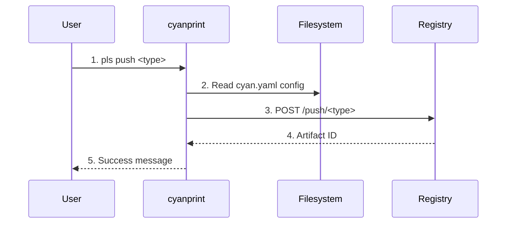

# push Command

**Key File**: `cyanprint/src/main.rs:35-129`

## Usage

```bash
pls push <type> [options]
```

## Description

Publishes CyanPrint artifacts (templates, template groups, plugins, processors) to the registry.

## Subcommands

| Subcommand  | Description                                 |
| ----------- | ------------------------------------------- |
| `template`  | Push executable template with Docker images |
| `group`     | Push template group (no Docker artifacts)   |
| `plugin`    | Push plugin Docker image                    |
| `processor` | Push processor Docker image                 |

## Options

| Option      | Short | Default          | Description                  |
| ----------- | ----- | ---------------- | ---------------------------- |
| `--config`  | `-c`  | `cyan.yaml`      | Configuration file path      |
| `--message` | `-m`  | `No description` | Publish message/description  |
| `--token`   | `-t`  | (required)       | API token for authentication |

**Environment Variable**: `CYAN_TOKEN`

**Key File**: `cyanprint/src/commands.rs:100-118`

## Subcommand Details

### push template

Publish executable template with blob and template Docker images.

```bash
pls push template \
  --config cyan.yaml \
  --token YOUR_TOKEN \
  --message "Initial release" \
  --template-image registry/user/template:latest \
  --template-tag latest \
  --blob-image registry/user/blobs:latest \
  --blob-tag latest
```

**Arguments**:

- `--template-image` - Template container image
- `--template-tag` - Template image tag
- `--blob-image` - Blob storage container image
- `--blob-tag` - Blob image tag

**Key File**: `cyanprint/src/main.rs:56-88`

Output:

```
✅ Pushed template successfully
📦 Template ID: 12345
```

### push group

Publish template group (meta-template with no execution artifacts).

```bash
pls push group --config cyan.yaml --token YOUR_TOKEN --message "Group template"
```

**Key File**: `cyanprint/src/main.rs:89-108`

Output:

```
🔗 Pushing template group (no Docker artifacts)...
✅ Pushed template group successfully
📦 Template ID: 12346
```

### push plugin

Publish plugin Docker image.

```bash
pls push plugin \
  --config cyan.yaml \
  --token YOUR_TOKEN \
  --message "Plugin release" \
  --image registry/user/plugin:latest \
  --tag latest
```

**Key File**: `cyanprint/src/main.rs:110-129`

### push processor

Publish processor Docker image.

```bash
pls push processor \
  --config cyan.yaml \
  --token YOUR_TOKEN \
  --message "Processor release" \
  --image registry/user/processor:latest \
  --tag latest
```

**Key File**: `cyanprint/src/main.rs:36-54`

## Flow



| #   | Step             | What                   | Key File              |
| --- | ---------------- | ---------------------- | --------------------- |
| 1   | Parse command    | Parse type and options | `commands.rs:100-143` |
| 2   | Load config      | Read cyan.yaml         | `registry/client.rs`  |
| 3   | Push to registry | POST artifact data     | `registry/client.rs`  |
| 4   | Return ID        | Registry assigns ID    | `registry/client.rs`  |
| 5   | Display result   | Show success and ID    | `main.rs:44-48`       |

## Configuration File

`cyan.yaml` format (example):

```yaml
name: my-template
version: 1
templates:
  - id: dependency-template-id
description: My template description
```

**Key File**: Specified by `--config` option

## Exit Codes

| Code | Meaning                                 |
| ---- | --------------------------------------- |
| `0`  | Success                                 |
| `1`  | Push failed (network, auth, validation) |
| `2`  | Invalid config file                     |

## Related Commands

- [`create`](./02-create.md) - Create from pushed template
- [`update`](./03-update.md) - Update to latest pushed version
