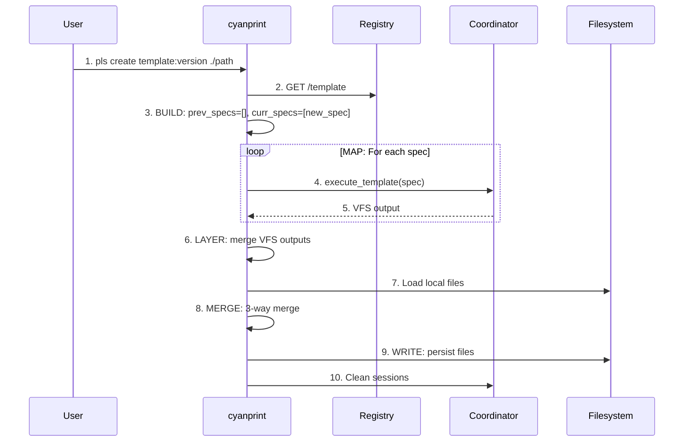

# create Command

**Key File**: `cyanprint/src/main.rs:131-191`

## Usage

```bash
pls create <template_ref> [path] [options]
```

## Description

Creates a new project from a template. The template is fetched from the registry and executed in the coordinator service.

## Arguments

| Argument         | Required | Description                                                |
| ---------------- | -------- | ---------------------------------------------------------- |
| `<template_ref>` | Yes      | Template reference in format `<username>/<name>:<version>` |
| `[path]`         | No       | Destination directory (default: current directory)         |

## Options

| Option                   | Short | Default                           | Description                  |
| ------------------------ | ----- | --------------------------------- | ---------------------------- |
| `--coordinator-endpoint` | `-c`  | `http://coord.cyanprint.dev:9000` | Coordinator service endpoint |

**Environment Variable**: `CYANPRINT_COORDINATOR`

**Key File**: `cyanprint/src/commands.rs:32-46`

## Examples

### Basic Usage

```bash
pls create atomicloud/starter:1 ./my-project
```

Output:

```text
🚘 Retrieving template 'atomicloud/starter:1' from registry...
✅ Retrieved template 'atomicloud/starter:1' from registry.
✅ Completed successfully
🧹 Cleaning up all sessions...
✅ Cleaned up all sessions
```

### With Default Coordinator

```bash
pls create atomicloud/starter:1 ./my-project
# Uses default coordinator: http://coord.cyanprint.dev:9000
```

### With Custom Coordinator

```bash
pls create atomicloud/starter:1 ./my-project --coordinator-endpoint http://localhost:9000
```

## Flow (v4+ Batch Processing)



| Order | Step           | What                              | Key File                |
| ----- | -------------- | --------------------------------- | ----------------------- |
| 1     | Parse command  | Parse template reference and path | `commands.rs:34`        |
| 2     | Fetch template | Get template from registry        | `main.rs:142-157`       |
| 3     | BUILD          | Construct prev_specs, curr_specs  | `update/spec.rs`        |
| 4-5   | MAP            | Execute each spec → VFS           | `run.rs::batch_process` |
| 6     | LAYER          | Merge VFS outputs                 | `run.rs::batch_process` |
| 7-8   | MERGE          | 3-way merge with local            | `run.rs::batch_process` |
| 9     | WRITE          | Persist merged result             | `run.rs::batch_process` |
| 10    | Cleanup        | Remove session artifacts          | `main.rs:179-181`       |

**Key File**: `cyanprint/src/run.rs::batch_process()`

## Template Reference Format

```text
<username>/<template_name>:<version>
```

Components:

- `username` - Template author/organization
- `template_name` - Template identifier
- `version` - Version number (integer)

**Key File**: `cyanprint/src/util.rs` → `parse_ref()`

## Exit Codes

| Code | Meaning                           |
| ---- | --------------------------------- |
| `0`  | Success                           |
| `1`  | General error                     |
| `2`  | Invalid template reference format |

## Related Commands

- [`update`](./03-update.md) - Update existing template
- [`push`](./01-push.md) - Publish new template
- [`daemon`](./04-daemon.md) - Start coordinator service
