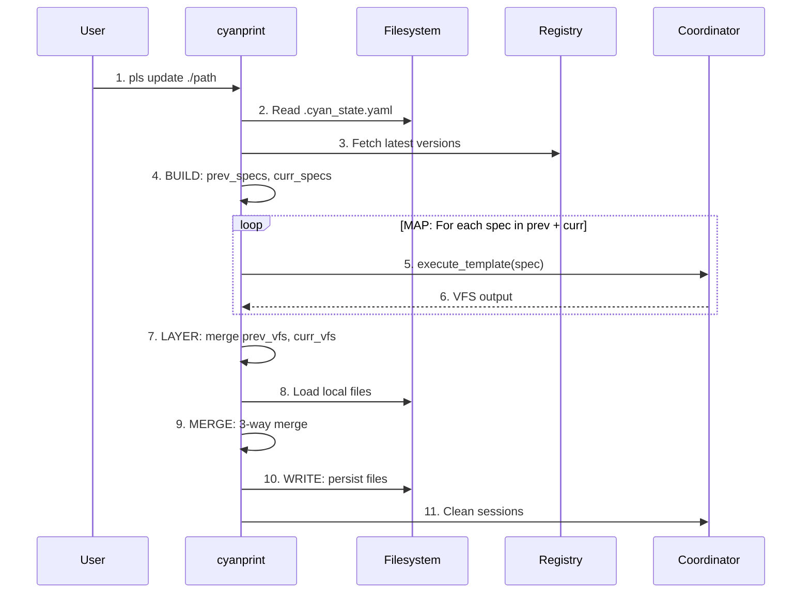

# update Command

**Key File**: `cyanprint/src/main.rs:192-227`

## Usage

```bash
pls update [path] [options]
```

## Description

Updates all templates in a project to their latest versions. Detects template history from `.cyan_state.yaml` and performs 3-way merge to preserve user changes.

## Arguments

| Argument | Required | Description                                   |
| -------- | -------- | --------------------------------------------- |
| `[path]` | No       | Project path (default: current directory `.`) |

## Options

| Option                   | Short | Default                           | Description                                |
| ------------------------ | ----- | --------------------------------- | ------------------------------------------ |
| `--coordinator-endpoint` | `-c`  | `http://coord.cyanprint.dev:9000` | Coordinator service endpoint               |
| `--interactive`          | `-i`  | `false`                           | Enable interactive mode to select versions |

> **Note**: The default coordinator endpoint uses unencrypted HTTP. This is intended for internal/VPN-cluster usage. For production or public network environments, use an HTTPS endpoint via `--coordinator-endpoint` or the `CYANPRINT_COORDINATOR` environment variable.

**Environment Variables**:

- `CYANPRINT_COORDINATOR` - Override coordinator endpoint

**Key File**: `cyanprint/src/commands.rs:52-72`

## Examples

### Basic Usage

```bash
pls update ./my-project
```

Output:

```text
🔄 Updating templates to latest versions
🔍 Resolving dependencies for template: my-template (v2)
📋 Deterministic template execution order...
🔄 Upgrading template composition from version 1 to 2
✅ Update completed successfully
🧹 Cleaning up all sessions...
✅ Cleaned up all sessions
```

### Interactive Mode

```bash
pls update ./my-project --interactive
```

Prompts user to select specific versions for each template.

### Default Path (Current Directory)

```bash
pls update
# Equivalent to: pls update .
```

## Flow (v4+ Batch Processing)



| #   | Step           | What                             | Key File                |
| --- | -------------- | -------------------------------- | ----------------------- |
| 1   | Parse command  | Parse path and options           | `commands.rs:52-72`     |
| 2   | Load state     | Read `.cyan_state.yaml`          | `state/reader.rs`       |
| 3   | Fetch versions | Get latest from registry         | `registry/client.rs`    |
| 4   | BUILD          | Construct prev_specs, curr_specs | `update/spec.rs`        |
| 5-6 | MAP            | Execute each spec → VFS          | `run.rs::batch_process` |
| 7   | LAYER          | Merge VFS lists                  | `run.rs::batch_process` |
| 8-9 | MERGE          | 3-way merge with local           | `run.rs::batch_process` |
| 10  | WRITE          | Persist merged result            | `run.rs::batch_process` |
| 11  | Cleanup        | Remove sessions                  | `main.rs`               |

**Key File**: `cyanprint/src/run.rs::batch_process()`

## Update Detection

The command determines update type by comparing versions:

| Previous          | Current      | Behavior                 |
| ----------------- | ------------ | ------------------------ |
| No state file     | Any          | New template (create)    |
| Same version      | Same version | Rerun with fresh Q&A     |
| Different version | New version  | Upgrade with 3-way merge |

**Key File**: `cyancoordinator/src/template/history.rs:69-115`

## State File Format

`.cyan_state.yaml` content:

```yaml
templates:
  username/template-name:
    active: true
    history:
      - version: 1
        time: '2024-01-15T10:30:00Z'
        answers:
          project-name: 'my-project'
        deterministic_states: {}
```

## Interactive Mode

When `--interactive` is enabled:

1. Fetch available versions for each template
2. Present version selection UI
3. User selects specific versions
4. Execute with selected versions

**Key File**: `cyanprint/src/update/version_manager.rs`

## Exit Codes

| Code | Meaning                    |
| ---- | -------------------------- |
| `0`  | Success                    |
| `1`  | Error during update        |
| `2`  | Invalid path or state file |

## Related Commands

- [`create`](./02-create.md) - Create from template
- [`push`](./01-push.md) - Publish template updates
- [`daemon`](./04-daemon.md) - Start coordinator service
