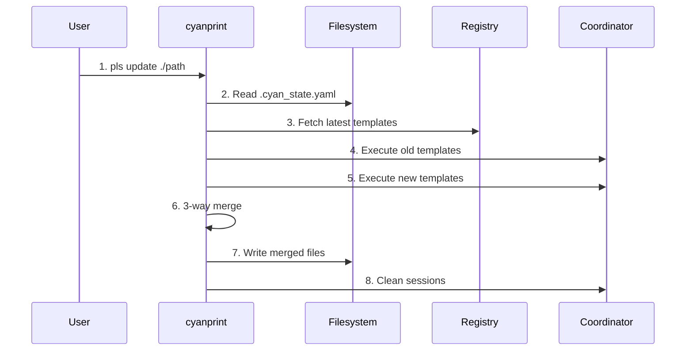

# update Command

**Key File**: `cyanprint/src/main.rs:192-227`

## Usage

```bash
pls update [path] [options]
```

## Description

Updates all templates in a project to their latest versions. Detects template history from `.cyan_state.yaml` and performs 3-way merge to preserve user changes.

## Arguments

| Argument | Required | Description                                   |
| -------- | -------- | --------------------------------------------- |
| `[path]` | No       | Project path (default: current directory `.`) |

## Options

| Option                   | Short | Default                           | Description                                |
| ------------------------ | ----- | --------------------------------- | ------------------------------------------ |
| `--coordinator-endpoint` | `-c`  | `http://coord.cyanprint.dev:9000` | Coordinator service endpoint               |
| `--interactive`          | `-i`  | `false`                           | Enable interactive mode to select versions |

**Environment Variables**:

- `CYANPRINT_COORDINATOR` - Override coordinator endpoint

**Key File**: `cyanprint/src/commands.rs:48-72`

## Examples

### Basic Usage

```bash
pls update ./my-project
```

Output:

```text
🔄 Updating templates to latest versions
🔍 Resolving dependencies for template: my-template (v2)
📋 Deterministic template execution order...
🔄 Upgrading template composition from version 1 to 2
✅ Update completed successfully
🧹 Cleaning up all sessions...
✅ Cleaned up all sessions
```

### Interactive Mode

```bash
pls update ./my-project --interactive
```

Prompts user to select specific versions for each template.

### Default Path (Current Directory)

```bash
pls update
# Equivalent to: pls update .
```

## Flow



| #   | Step            | What                              | Key File                                         |
| --- | --------------- | --------------------------------- | ------------------------------------------------ |
| 1   | Parse command   | Parse path and options            | `commands.rs:52-72`                              |
| 2   | Load state      | Read `.cyan_state.yaml`           | `cyancoordinator/src/template/history.rs:69-115` |
| 3   | Fetch templates | Get latest versions from registry | `registry/client.rs`                             |
| 4   | Execute old     | Recreate previous composition     | `operator.rs:170-195`                            |
| 5   | Execute new     | Create new composition            | `operator.rs:197-205`                            |
| 6   | 3-way merge     | Merge old, local, new             | `merger.rs:perform_git_merge()`                  |
| 7   | Write files     | Persist merged result             | `fs/writer.rs`                                   |
| 8   | Cleanup         | Remove sessions                   | `main.rs:217-219`                                |

## Update Detection

The command determines update type by comparing versions:

| Previous          | Current      | Behavior                 |
| ----------------- | ------------ | ------------------------ |
| No state file     | Any          | New template (create)    |
| Same version      | Same version | Rerun with fresh Q&A     |
| Different version | New version  | Upgrade with 3-way merge |

**Key File**: `cyancoordinator/src/template/history.rs:69-115`

## State File Format

`.cyan_state.yaml` content:

```yaml
templates:
  username/template-name:
    active: true
    history:
      - version: 1
        time: '2024-01-15T10:30:00Z'
        answers:
          project-name: 'my-project'
        deterministic_states: {}
```

## Interactive Mode

When `--interactive` is enabled:

1. Fetch available versions for each template
2. Present version selection UI
3. User selects specific versions
4. Execute with selected versions

**Key File**: `cyanprint/src/update.rs`

## Exit Codes

| Code | Meaning                    |
| ---- | -------------------------- |
| `0`  | Success                    |
| `1`  | Error during update        |
| `2`  | Invalid path or state file |

## Related Commands

- [`create`](./02-create.md) - Create from template
- [`push`](./01-push.md) - Publish template updates
- [`daemon`](./04-daemon.md) - Start coordinator service
