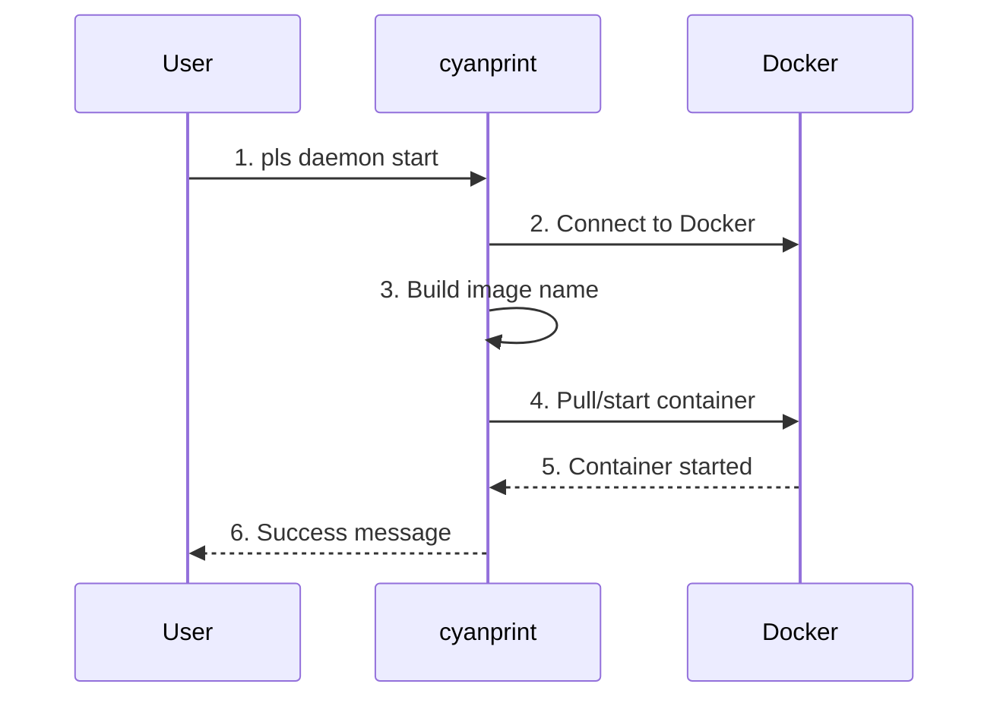
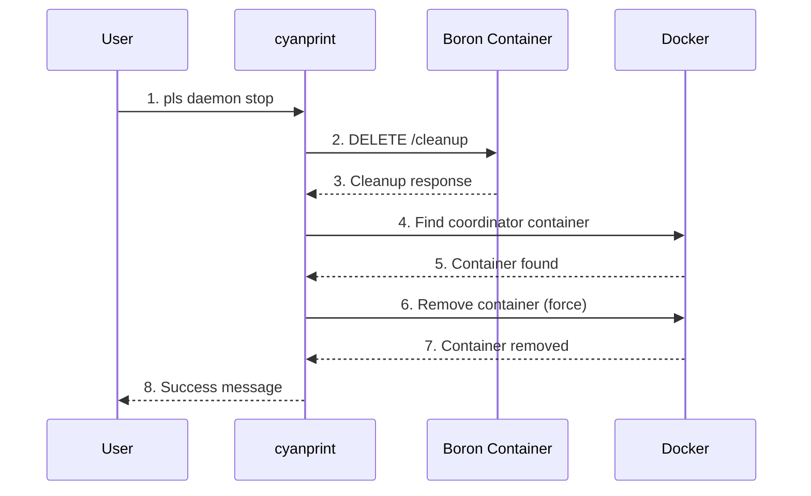

# daemon Command

**Key File**: `cyanprint/src/main.rs:228-270`, `cyanprint/src/coord.rs`

> **Note**: `pls` is a development alias that runs the CLI via `cargo run` from the current codebase. Use `cyanprint` when invoking the installed binary.

## Usage

```bash
pls daemon <start|stop> [options]
```

## Subcommands

| Subcommand | Description                            |
| ---------- | -------------------------------------- |
| `start`    | Start the CyanPrint Coordinator daemon |
| `stop`     | Stop and cleanup the daemon            |

## `daemon start`

Starts the CyanPrint Coordinator service locally in a Docker container. The coordinator handles template execution for `create` and `update` commands.

### Arguments

| Argument    | Required | Description                             |
| ----------- | -------- | --------------------------------------- |
| `[version]` | No       | Coordinator version (default: `latest`) |

### Options

| Option       | Short | Default                                               | Description                       |
| ------------ | ----- | ----------------------------------------------------- | --------------------------------- |
| `--port`     | `-p`  | `9000`                                                | Port to host the daemon           |
| `--registry` | `-r`  | `https://api.zinc.sulfone.raichu.cluster.atomi.cloud` | Registry endpoint for coordinator |

**Environment Variable**: `CYANPRINT_REGISTRY`

**Key File**: `cyanprint/src/commands.rs:83-106`

### Examples

#### Basic Usage (Latest Version)

```bash
pls daemon start
```

Output:

```text
✅ Coordinator started on port 9000
```

#### Specific Version

```bash
pls daemon start 1.5.0
```

#### Custom Port

```bash
pls daemon start --port 8080
```

Output:

```text
✅ Coordinator started on port 8080
```

#### With Custom Registry

```bash
pls daemon start --registry https://custom-registry.com
```

## `daemon stop`

Stops the CyanPrint Coordinator daemon and performs cleanup. This command:

1. Calls `DELETE /cleanup` on the Boron container to clean up Docker resources
2. Removes the `cyanprint-coordinator` container

### Options

| Option   | Short | Default | Description                  |
| -------- | ----- | ------- | ---------------------------- |
| `--port` | `-p`  | `9000`  | Port where daemon is running |

**Key File**: `cyanprint/src/commands.rs:108-118`

### Examples

#### Basic Usage

```bash
pls daemon stop
```

Output:

```text
🧹 Calling cleanup endpoint on coordinator...
✅ Cleanup completed
🔍 Looking for coordinator container...
🗑️ Removing container: abc123...
✅ Container removed
✅ Coordinator stopped
```

#### Custom Port

```bash
pls daemon stop --port 8080
```

#### When Not Running

```bash
pls daemon stop
```

Output:

```text
🧹 Calling cleanup endpoint on coordinator...
⚠️ Cleanup endpoint failed: connection refused
🔍 Looking for coordinator container...
✅ No coordinator container found
✅ Coordinator stopped
```

## Flow

### Start Flow



| #   | Step            | What                      | Key File                       |
| --- | --------------- | ------------------------- | ------------------------------ |
| 1   | Parse command   | Parse version and options | `commands.rs:83-106`           |
| 2   | Connect Docker  | Initialize Docker client  | `main.rs:229-230`              |
| 3   | Build image     | Construct image reference | `main.rs:242-244`              |
| 4   | Start container | Pull and run in Docker    | `coord.rs:start_coordinator()` |
| 5   | Verify          | Check container running   | `coord.rs`                     |
| 6   | Display result  | Show success message      | `main.rs:247-248`              |

### Stop Flow



| #   | Step             | What                     | Key File                      |
| --- | ---------------- | ------------------------ | ----------------------------- |
| 1   | Parse command    | Parse port option        | `commands.rs:108-118`         |
| 2   | Call cleanup     | DELETE /cleanup endpoint | `coord.rs:stop_coordinator()` |
| 3   | Handle response  | Print cleanup results    | `coord.rs:21-33`              |
| 4   | Find container   | List containers by name  | `coord.rs:41-53`              |
| 5   | Remove container | Force remove coordinator | `coord.rs:60-73`              |
| 6   | Confirm removal  | Docker confirms removal  | `coord.rs:73`                 |
| 7   | Display result   | Show success message     | `main.rs:278-279`             |

## Docker Image

Default image: `ghcr.io/atomicloud/sulfone.boron/sulfone-boron:<version>`

**Key File**: `cyanprint/src/main.rs:242-244`

## Coordinator Endpoints

Once started, the coordinator provides:

| Endpoint                      | Method | Purpose                  |
| ----------------------------- | ------ | ------------------------ |
| `/executor`                   | POST   | Start template execution |
| `/executor/{session_id}`      | DELETE | Clean up session         |
| `/executor/{session_id}/warm` | POST   | Warm executor cache      |
| `/template/warm`              | POST   | Warm template cache      |
| `/cleanup`                    | DELETE | Full daemon cleanup      |

**Base URL**: `http://localhost:<port>`

**Key File**: `cyancoordinator/src/client.rs`

## Prerequisites

- Docker must be running and accessible
- Port must be available (not in use)
- Image must be accessible (or pullable)

## Usage with Other Commands

After starting the daemon, use `--coordinator-endpoint` with other commands:

```bash
# Terminal 1: Start daemon
pls daemon start --port 9000

# Terminal 2: Use local coordinator
pls create template:1 ./project --coordinator-endpoint http://localhost:9000
```

## Troubleshooting

### Port Already in Use

```text
Error: Port 9000 already in use
```

**Solution**: Use different port or stop existing daemon:

```bash
pls daemon stop
# or
pls daemon start --port 9001
```

### Docker Not Running

```text
Error: Failed to connect to Docker daemon
```

**Solution**: Start Docker Desktop or Docker daemon.

### Image Not Found

```text
Error: Image pull failed
```

**Solution**: Check internet connection and image name.

## Exit Codes

> **Note**: Only exit codes 0 and 1 are currently implemented. Codes 2 and 3 are
> planned for future versions to provide semantic differentiation between error types.

| Code | Meaning             | Status  |
| ---- | ------------------- | ------- |
| `0`  | Success             | Active  |
| `1`  | Docker error        | Active  |
| `2`  | Port already in use | Planned |
| `3`  | Image pull failed   | Planned |

## Related Commands

- [`create`](./02-create.md) - Use coordinator for template execution
- [`update`](./03-update.md) - Use coordinator for template updates
