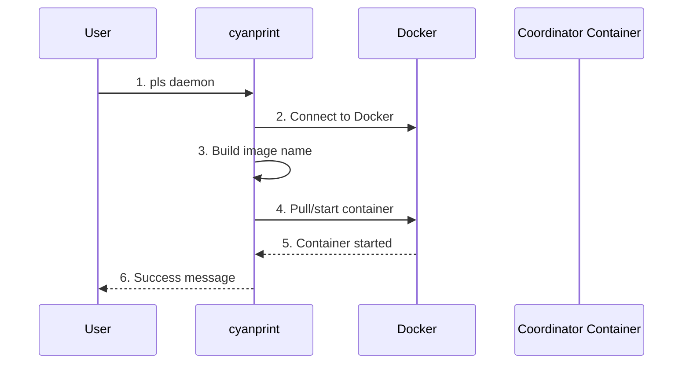

# daemon Command

**Key File**: `cyanprint/src/main.rs:228-255`, `cyanprint/src/coord.rs`

## Usage

```bash
pls daemon [version] [options]
```

## Description

Starts the CyanPrint Coordinator service locally in a Docker container. The coordinator handles template execution for `create` and `update` commands.

## Arguments

| Argument    | Required | Description                             |
| ----------- | -------- | --------------------------------------- |
| `[version]` | No       | Coordinator version (default: `latest`) |

## Options

| Option       | Short | Default                                               | Description                       |
| ------------ | ----- | ----------------------------------------------------- | --------------------------------- |
| `--port`     | `-p`  | `9000`                                                | Port to host the daemon           |
| `--registry` | `-r`  | `https://api.zinc.sulfone.raichu.cluster.atomi.cloud` | Registry endpoint for coordinator |

**Environment Variable**: `CYANPRINT_REGISTRY`

**Key File**: `cyanprint/src/commands.rs:74-97`

## Examples

### Basic Usage (Latest Version)

```bash
pls daemon
```

Output:

```text
✅ Coordinator started on port 9000
```

### Specific Version

```bash
pls daemon 1.5.0
```

### Custom Port

```bash
pls daemon --port 8080
```

Output:

```text
✅ Coordinator started on port 8080
```

### With Custom Registry

```bash
pls daemon --registry https://custom-registry.com
```

## Flow



| #   | Step            | What                      | Key File                       |
| --- | --------------- | ------------------------- | ------------------------------ |
| 1   | Parse command   | Parse version and options | `commands.rs:74-97`            |
| 2   | Connect Docker  | Initialize Docker client  | `main.rs:233-234`              |
| 3   | Build image     | Construct image reference | `main.rs:240-242`              |
| 4   | Start container | Pull and run in Docker    | `coord.rs:start_coordinator()` |
| 5   | Verify          | Check container running   | `coord.rs`                     |
| 6   | Display result  | Show success message      | `main.rs:246`                  |

## Docker Image

Default image: `ghcr.io/atomicloud/sulfone.boron/sulfone-boron:<version>`

**Key File**: `cyanprint/src/main.rs:240-242`

## Coordinator Endpoints

Once started, the coordinator provides:

| Endpoint     | Method | Purpose                  |
| ------------ | ------ | ------------------------ |
| `/bootstrap` | POST   | Start template execution |
| `/clean`     | POST   | Clean up session         |
| `/warm`      | POST   | Warm executor cache      |

**Base URL**: `http://localhost:<port>`

**Key File**: `cyancoordinator/src/client.rs`

## Prerequisites

- Docker must be running and accessible
- Port must be available (not in use)
- Image must be accessible (or pullable)

## Usage with Other Commands

After starting the daemon, use `--coordinator-endpoint` with other commands:

```bash
# Terminal 1: Start daemon
pls daemon --port 9000

# Terminal 2: Use local coordinator
pls create template:1 ./project --coordinator-endpoint http://localhost:9000
```

## Troubleshooting

### Port Already in Use

```
Error: Port 9000 already in use
```

**Solution**: Use different port or stop existing daemon:

```bash
pls daemon --port 9001
```

### Docker Not Running

```
Error: Failed to connect to Docker daemon
```

**Solution**: Start Docker Desktop or Docker daemon.

### Image Not Found

```
Error: Image pull failed
```

**Solution**: Check internet connection and image name.

## Exit Codes

| Code | Meaning             |
| ---- | ------------------- |
| `0`  | Success             |
| `1`  | Docker error        |
| `2`  | Port already in use |
| `3`  | Image pull failed   |

## Related Commands

- [`create`](./02-create.md) - Use coordinator for template execution
- [`update`](./03-update.md) - Use coordinator for template updates
