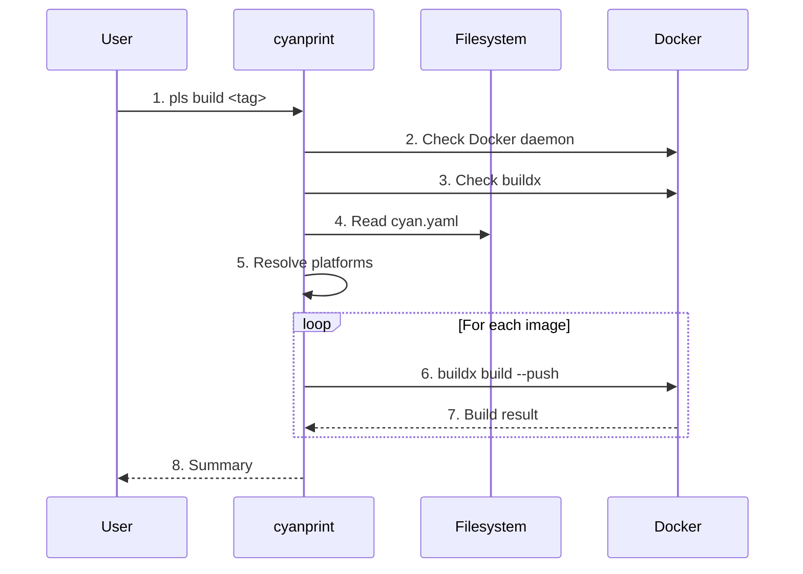

# build Command

**Key File**: `cyanprint/src/main.rs:handle_build`

## Usage

```bash
pls build <TAG> [options]
```

## Description

Builds Docker images using Docker buildx for multi-platform support. Reads build configuration from `cyan.yaml` and builds all defined images with the specified tag.

## Arguments

| Argument | Description                           |
| -------- | ------------------------------------- |
| `<TAG>`  | Version tag for the images (required) |

## Options

| Option       | Short | Default     | Description                        |
| ------------ | ----- | ----------- | ---------------------------------- |
| `--config`   | `-c`  | `cyan.yaml` | Configuration file path            |
| `--platform` | `-p`  | (config)    | Target platforms (comma-separated) |
| `--builder`  | `-b`  | (default)   | Buildx builder to use              |
| `--no-cache` |       | `false`     | Don't use cache                    |
| `--dry-run`  |       | `false`     | Show commands without executing    |

**Key File**: `cyanprint/src/commands.rs:28-46`

## Pre-flight Checks

Before building, the command verifies:

1. Docker daemon is running
2. Docker buildx is available

These checks are skipped in `--dry-run` mode.

**Key File**: `cyanprint/src/docker/buildx.rs:26-48`

## Platform Resolution

Platforms are resolved in order:

1. CLI `--platform` option (highest priority)
2. `build.platforms` from config file
3. Current platform (fallback)

**Key File**: `cyanprint/src/main.rs:handle_build`

## Configuration File

The `cyan.yaml` must contain a `build` section:

```yaml
build:
  registry: ghcr.io/atomicloud
  platforms:
    - linux/amd64
    - linux/arm64
  images:
    template:
      dockerfile: docker/Dockerfile.template
      context: .
    blob:
      dockerfile: docker/Dockerfile.blob
      context: ./blob
    processor:
      dockerfile: docker/Dockerfile.processor
      context: ./processor
    plugin:
      dockerfile: docker/Dockerfile.plugin
      context: ./plugin
    resolver:
      dockerfile: docker/Dockerfile.resolver
      context: ./resolver
```

### Configuration Fields

| Field                      | Required | Description                                         |
| -------------------------- | -------- | --------------------------------------------------- |
| `registry`                 | Yes      | Container registry URL                              |
| `platforms`                | No       | List of target platforms                            |
| `images`                   | Yes      | Image configurations (at least one required)        |
| `images.<type>`            | No       | One of: template, blob, processor, plugin, resolver |
| `images.<type>.dockerfile` | Yes      | Path to Dockerfile                                  |
| `images.<type>.context`    | Yes      | Build context directory                             |

**Key File**: `cyanregistry/src/cli/models/build_config.rs`

## Examples

### Basic build

```bash
pls build v1.0.0
```

Output:

```text
🔨 Building Docker images with tag: v1.0.0
🔍 Running pre-flight checks...
  ✓ Docker daemon is running
  ✓ Docker buildx is available
📄 Loading configuration from: cyan.yaml
  ✓ Configuration loaded successfully
  ✓ Registry: ghcr.io/atomicloud
  ✓ Platforms: linux/amd64, linux/arm64

📦 Found 5 image(s) to build

🔨 Building image: template
  Dockerfile: docker/Dockerfile.template
  Context: .
  ✅ Successfully built template
...
📊 Build Summary:
  Total images: 5
  Successful: 5
  Failed: 0

✅ All images built successfully!
```

### Single platform build

```bash
pls build v1.0.0 --platform linux/amd64
```

### Dry-run mode

```bash
pls build v1.0.0 --dry-run
```

Output:

```text
🏃 Dry-run mode - showing commands without executing:

🔨 Building image: template
  Dockerfile: docker/Dockerfile.template
  Context: .
  docker buildx build --push --platform linux/amd64 --file docker/Dockerfile.template --tag ghcr.io/atomicloud/template:v1.0.0 .
...
```

### No cache build

```bash
pls build v1.0.0 --no-cache
```

### Custom builder

```bash
pls build v1.0.0 --builder multi-arch
```

## Flow



| #   | Step              | What                         | Key File                      |
| --- | ----------------- | ---------------------------- | ----------------------------- |
| 1   | Parse command     | Parse tag and options        | `commands.rs:28-46`           |
| 2   | Check Docker      | Verify daemon running        | `docker/buildx.rs:26-36`      |
| 3   | Check buildx      | Verify buildx available      | `docker/buildx.rs:38-48`      |
| 4   | Load config       | Read cyan.yaml build section | `mapper.rs:read_build_config` |
| 5   | Resolve platforms | CLI → config → current       | `main.rs:handle_build`        |
| 6   | Build images      | buildx build for each image  | `docker/buildx.rs:50-103`     |
| 7   | Track results     | Success/failure counts       | `main.rs:handle_build`        |
| 8   | Print summary     | Display build results        | `main.rs:handle_build`        |

## Exit Codes

| Code | Meaning                                                         |
| ---- | --------------------------------------------------------------- |
| `0`  | Success - all images built                                      |
| `1`  | Error - build failed, config error, or pre-flight check failure |

## Error Handling

| Scenario             | Error Message                                            |
| -------------------- | -------------------------------------------------------- |
| Docker not running   | "Docker daemon is not running. Please start Docker."     |
| buildx not available | "Docker buildx is not available. Please install buildx." |
| No build section     | "No build configuration found in cyan.yaml"              |
| Missing registry     | "build.registry is required"                             |
| No images defined    | "At least one image must be defined in build.images"     |
| Build failure        | Shows full buildx output with error details              |

**Key File**: `cyanregistry/src/cli/mapper.rs:ParsingError`

## Related Commands

- [`push`](./01-push.md) - Publish built artifacts to registry
- [`daemon`](./04-daemon.md) - Start local coordinator daemon
